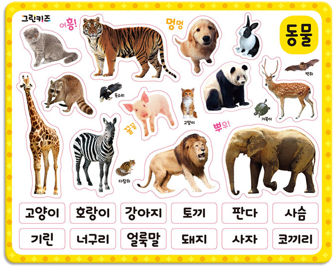

# 머신러닝이란?

머신러닝이란 데이터에서 패턴을 찾아 새로운 데이터의 결과값을 예측하는 방법이며 크게 지도학습, 비지도학습, 강화학습으로 나눌수 있습니다.

## 지도학습(Supervised Learning)

지도학습은 정답을 알려주며 학습시키는 것입니다. 예를들어 고양이 사진을 준 후(input data), 이 사진은 고양이(label data)라는 것를 알려준 후, 이러한 패턴을 바탕으로 새로운 데이터의 결과값을 예측하는 방식입니다. 따라서 기계가 정답을 잘 맞췄는지 아닌지 쉽게 알 수 있다. 지도학습에는 크게 분류(classification)과 회귀(regression)가 있습니다.

- 분류(classification): 두 가지 혹은 여러 값 중 하나로 분류하는 것입니다. 예를 들어 특정 이메일이 스팸인가 아닌가 혹은 개인의 신용등급을 분류하는 방식입니다.

- 회귀(regression): 어떤 데이터들의 특징(feature)을 토대로 값을 예측하는 것입니다. 

## 비지도학습(Unsupervised Learning)

정답(label)을 따로 알려주지 않은 상태에서, 비슷한 데이터들을 군집화 하는 것입니다. 

예를들어 고양이, 병아리, 기린, 호랑이 사진을 비지도학습 시킬 경우, 각 사진이 무슨 동물인지 정답(label)을 알려주지 않았기 때문에 이 동물이 '무엇'이라고 기계가 정의는 할 수 없지만 비슷한 단위로 군집화 해준다.다리가 4개인 고양이와 호랑이를 한 분류로 묶고, 다리가 4개지만 목이 긴 기린은 다른 분류로, 다리가 얇고 몸통이 둥그런 병아리는 또 다른 분류로 나누어 놓을 것입니다.

```{r echo = FALSE}

```

실무에서는 지도학습에서의 적절한 feature를 찾아내기 위한 전처리 방법으로 비지도 학습을 쓰기도 합니다.


## 딥러닝 / 강화학습(Reinforcement Learning)

상과 벌이라는 보상(reward)을 주며 상을 최대화하고 벌을 최소화 하도록 강화 학습하는 방식입니다. 알파고가 이 방법으로 학습 되었고, 주로 게임에서 최적의 동작을 찾는데 쓰는 학습 방식입니다.


## 사용 패키지

본 과정에서 사용되는 패키지는 다음과 같이 설치할 수 있습니다. (업데이트 중)

```{r}
pkg = c('alr3', 'caret', 'ISLR', 'MASS',
        'leaps', 'car', 'corrplot', 'lmtest')

new.pkg = pkg[!(pkg %in% installed.packages()[, "Package"])]
if (length(new.pkg)) {
  install.packages(new.pkg, dependencies = TRUE)}
```


