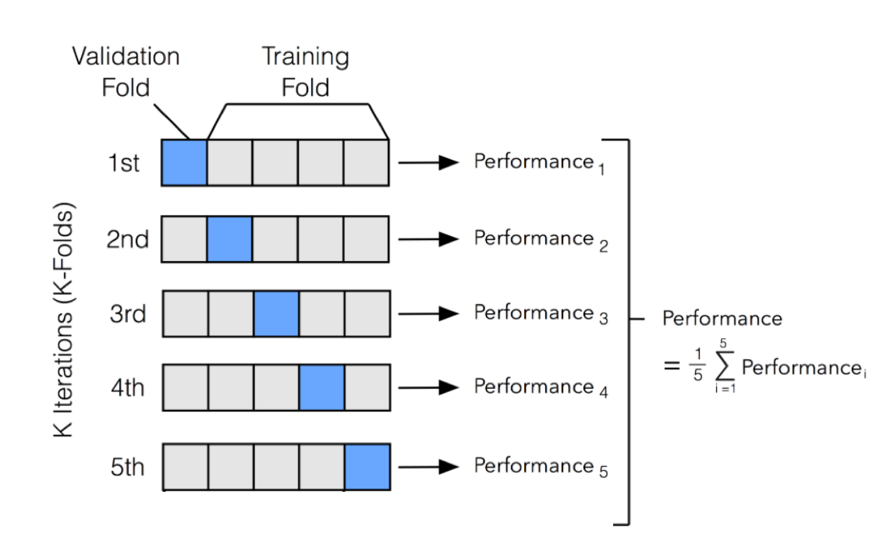

# 로지스틱 회귀

## 오즈비

오즈는 성공할 확률이 실패할 확률의 몇 배인지를 나타내는 것으로써, $Probability(Y) / 1 - (Probability(Y))$ 공식을 통해 계산됩니다. 예를 들어, 브라질이 월드컵 경기에서 이길 확률이 20%라면, 오즈는 $0.2 / (1-0.2) = 0.25$가 되고, 1대 4의 승산입니다. 오즈를 확률로 역변환하려면 오즈를 $1 + (오즈)$로 나누며, 앞의 예에서는 $0.25 / (1+0.25) = 0.2$, 즉 20%가 됩니다.

만일 독일이 우승할 오즈가 0.18, 브라질이 우승할 오즈가 0.25인 경우 둘 간의 오즈를 오즈비를 이용해 비교할 수 있습니다. 브라질이 독일 대비 월드컵에서 우승할 확률은 0.25 / 0.18 = 1.39 입니다.

## 로지스틱 회귀

결과가 이항 혹은 다항 범주일 경우, 관찰값이 출력 변수의 특정 범주에 속할 확률을 예측해야 합니다. 이를 위해 기존 OLS 선형 회귀를 사용할 경우 매우 큰 측정 오차가 생길 수 있으며 편향된 결과를 낳습니다.

분류 문제는 0과 1 사이의 값을 갖는 확률로 가장 잘 모형화할 수 있습니다. 로지스틱 회귀와 선형 회귀의 관계는 로지스틱 회귀의 종속 변수를 로그 오즈, 즉 $log(P(Y) / 1-P(Y))$로 표현하고 이 값이 $a + bX$와 같음을 밝힘으로써 보일 수 있습니다. 이를 정리하면 다음과 같습니다.

$$log(\frac{P(Y)}{1-P(Y)}) = a + bX$$
$$\frac{P(Y)}{1-P(Y)} = e^{a + bX}$$
$$ P(Y) = \frac{e^{a + bX}}{1 + e^{a + bX}}  $$

위 $P(Y)$ 를 그래프로 나타내면 다음과 같다.

```{r echo = FALSE}
library(ggplot2)

logr_vm = glm(vs ~ mpg, data=mtcars, family = binomial(link="logit"))
ggplot(mtcars, aes(x=mpg, y=vs)) + geom_point() + 
  stat_smooth(method="glm", method.args=list(family="binomial"), se=FALSE) +
  theme_bw() +
  xlab('x') +
  ylab('p(y)')
```

즉 $x$에 따른 $y$의 확률이 0과 1 사이에 놓이게 됩니다.

## 입학 데이터 분석

GRE, GPA, RANK가 입학(admission)에 어떤 영향을 주는지 로지스틱 회귀분석을 통해 분석하도록 하겠습니다.

```{r}
admission = read.csv("https://stats.idre.ucla.edu/stat/data/binary.csv")
head(admission)
```

`glm()` 함수를 이용하여 로지스틱 회귀분석을 실시합니다.

```{r}
ad.logit = glm(admit ~ ., family = binomial, data = admission)
summary(ad.logit)
```

모든 변수가 유의미한 결과를 보입니다. 로지스틱 회귀에서는 OLS와는 다르게 피처의 계수를 $X$가 한 단위 변화할 때 $Y$가 변화하는 양을 나타낸다고 해석할 수 없습니다. 로그 함수에서 $\beta$라는 계수는 오즈비 $e^\beta$로 변환해 해석해야 합니다. 

```{r}
exp(coef(ad.logit))
```

오즈비는 피처가 한 단위 변했을 때 나타나는 결과의 오지로 해석할 수 있습니다. 만일 이 값이 1보다 크면 피처가 증가할 때 결과의 오즈도 증가하며, 1보다 작으면 피처가 증가할 때 결과의 오즈는 감소합니다.

위의 예에서 gre와 gpa는 로그 오즈를 증가시키지만, rank는 로그 오즈를 감소시킵니다.

```{r}
ad.probs = ad.logit$fitted.values
ad.probs = ifelse(ad.probs > 0.5, 1, 0)
```

회귀분석 결과의 fitted.values에는 확률이 저장되어 있으며, 해당 값이 0.5보다 크면 1, 그렇지 않으면 0로 변환해줍니다. 이를 실제 데이터와 비교해보도록 합니다.

```{r}
table(ad.probs, admission$admit)
prop.table(table(ad.probs, admission$admit))
```

맞게 판단할 확률이 대략 70% 입니다.

## 위스콘신 유방암 데이터

위스콘신 유방암 데이터를 통해 종양이 양성 혹은 악성인지에 대해 예측해보도록 하겠습니다. 해당 데이터는 MASS 패키지의 `biopsy` 이름으로 저장되어 있습니다. 

### 데이터 불러오기 및 편집

```{r}
library(MASS)

data(biopsy)
str(biopsy)
```

각 피처는 다음과 같습니다.

- ID: 표본의 코드 번호
- V1: 두께
- V2: 세포 크기의 균일성
- V3: 세포 모양의 균일성
- V4: 한계 부착력
- V5: 단일 상피세포 크기
- V6: 나핵(16개의 관찰값 결측)
- V7: 특징 없는 염색질
- V8: 정상 핵소체
- V9: 분열
- class: 종양의 진단의 결과, 양성 또는 악성. 우리가 예측하려는 결과

피처명이 입력되어 있지 않으므로, 이를 입력해주도록 합니다.

```{r}
biopsy$ID = NULL
names(biopsy) = c('thick', 'u.size', 'u.shape', 'adhsn', 's.size',
                  'nucl', 'chrom', 'n.nuc', 'mit', 'class')

head(biopsy)
```

다음으로 결측 관측치를 삭제 및 데이터를 변형해줍니다.

```{r}
sum(is.na(biopsy))
biopsy.v2 = na.omit(biopsy)
y = ifelse(biopsy.v2$class == 'malignant', 1, 0)
table(y)
```

총 16개의 na 데이터가 존재하며, `na.omit()` 함수를 통해 해당 데이터를 모두 지워주도록 합니다. 또한 예측변수 y에는 class가 malignant(악성)일 경우 1, 그렇지 않을 경우 0을 입력합니다.

`gather()` 함수를 통해 테이블을 변경한 후, `ggplot()` 함수를 통해 각 class 별 피처들의 분포를 살펴보도록 합니다.

```{r}
library(ggplot2)
library(dplyr)
library(tidyr)
library(magrittr)

biop.m = biopsy.v2 %>%
  gather(key, value, -class)

biop.m %>%
  ggplot(aes(x = class, y = value)) + 
  geom_boxplot() +
  facet_wrap( ~ key)
```

다중공선성 확인을 위해 상관관계를 검사하도록 합니다.

```{r}
library(corrplot)

bc = biopsy.v2 %>%
  dplyr::select(-class) %>%
  cor()

corrplot.mixed(bc)
```

u.size와 u.shape 간 상관관계가 0.91로 다중공선성 문제가 두드러져 보입니다.

### 데이터 나누기

기존에는 모든 데이터를 이용하여 모델을 훈련시켰습니다. 그러나 모델의 예측력을 평가하기 위해서는 모델링에 사용되지 않은 데이터와 평가하야 합니다. 이를 위해 트레이닝 및 테스트 세트로 나누도록 합니다. 일반적으로 트레이닝과 테스트 셋의 비율은 7:3 혹은 8:2로 합니다.

```{r echo = FALSE}
knitr::include_graphics('images/data_split.png')
```

```{r}
set.seed(123)

ind = sample(2, nrow(biopsy.v2), replace = TRUE,
             prob = c(0.7, 0.3))

train = biopsy.v2[ind==1, ]
test = biopsy.v2[ind==2, ]
```

```{r}
prop.table(table(train$class))
prop.table(table(test$class))
```

`sample()` 을 통해 무작위 숫자를 7:3 비율로 생성한 후, train과 test 셋으로 나눠주도록 합니다. 그 후 각 데이터 셋의 종속변수의 비율을 확인해 7:3 비율과 비슷한지 확인합니다.

### 모형화

먼저 모든 입력 변수로 로지스틱 모형을 만든 후 점차 줄여 나가며 최량 부분 집합을 생성하도록 합니다.

```{r}
full.fit = glm(class ~ ., family = binomial, data = train)
summary(full.fit)
exp(coef(full.fit)) %>% round(., 4)
```

위 예제에서 u.size를 제외한 모든 피처가 로그 오즈를 증가시킵니다. 다음으로 다중공선성을 확인합니다.

```{r}
library(car)
vif(full.fit)
```

위의 값들 중 어느 것도 통계값이 5보다 크지 않으므로 공선성을 크게 문제가 되지 안습니다. 

```{r}
train.probs = full.fit$fitted.values
head(train.probs)
```

확률을 선택한 후, 해당 값이 0.5보다 클 경우 1, 아닐 경우 0으로 구분합니다. 그 후 train 데이터의 class와 비교하여 예측 정확도를 비교해보도록 한다.

```{r}
train.bi = ifelse(train.probs > 0.5, 1, 0) %>% as.factor()
train.class = ifelse(train$class == 'malignant', 1, 0) %>% as.factor()

true.ratio = prop.table(table(train.bi, train.class))
print(true.ratio[1,1] + true.ratio[2,2])
```

예측 정확도가 `r round(true.ratio, 4)`로 매우 높게 나타납니다.

#### 혼돈 행렬(Confusion Matrix) 이해하기 

혼돈 행렬은 예측 값이 실제 값과 일치하는지에 따라 여측을 범주화한 표입니다. 한 차원은 예측 값을 나타내고, 다른 차원은 실제값을 나타냅니다. 

일반적으로 관심 있는 클래스를 positive 클래스, 다른 클래스들을 false 클래스라고 하며, 두 클래스의 관계는 네 종류의 범주 중 예측이 속하는 범주를 도표화한 2 X 2 혼동 행렬로 표현할 수 있습니다.


```{r echo = FALSE}

```

각 항목의 설명은 다음과 같습니다.

- True Positive: 관심 클래스로 정확하게 분류
- True Negative: 관심 클래스가 아닌 클래스로 정확하게 분류
- False Positive: 관심 클래스로 부정확학 분류
- False Negative: 관심 클래스가 아닌 클래스로 부정확하게 분류

혼돈 행렬을 이용한 성능 측정에는 다음과 같은 값들이 있습니다.

- **정확도(Accuracy)**: $\frac{TP + TN}{TP + TN + FP + FN}$, True Positive과 True Negative의 횟수를 전체 예측 횟수로 나눈 값

- 오류율(Error rate): $\frac{FP + FN}{TP + TN + FP + FN} = 1 - 정확도$, 부정확한 분류된 예시

- 재현율(Recall): $\frac{TP}{TP + FN}$, True Postiive 개수를 전체 긍정 개수로 나누어 계산. 민감도(Sensitivity)로도 불림

- 특이도(Specificity, 참 부정률): $\frac{TN}{TN + FP}$, True Negative의 개수를 전체 부정으로 나누어 계산

- 정밀도(Precision, 긍정 예측 값): $\frac{TP}{TP + FP}$, 모델이 Positive로 예측할 때 예측이 얼마나 정확한지 여부

- F 점수(F-score): $\frac{2 \times 정밀도 \times 재현율}{재현율 + 정밀도} = \frac{2 \times TP}{2 \times TP + FP+ FN}$, 조화 평균을 이용하여 정밀도와 재현율을 결합

혼돈 행렬은 caret 패키지의 `confusionMatrix(predict, truth)` 함수를 이용해 계산할 수 있습니다.

```{r}
caret::confusionMatrix(train.bi, train.class)
```

정확도를 의미하는 *Accuracy*가 0.9684로 직접 계산한 값과 동일합니다. 

### 테스트 셋에 적용

위 모형은 트레이닝 셋을 대상으로 만들어졌습니다. 따라서 모형에 포함되지 않은 데이터인 테스트 셋의 데이터를 대상으로 모델의 정확도를 구해보도록 합니다.

```{r}
test.probs = predict(full.fit, newdata = test, type = 'response')

test.bi = ifelse(test.probs > 0.5, 1, 0) %>% as.factor()
test.class = ifelse(test$class == 'malignant', 1, 0) %>% as.factor()

caret::confusionMatrix(test.bi, test.class)
```

`predict()` 함수의 newdata 인자에 test를 입력하여 확률을 계산한 후, 혼돈 행렬을 구하도록 합니다. 정확도가 0.9761로써 역시나 뛰어난 성과를 보입니다.

## 교차검증을 포함한 로지스틱 회귀

K-폴드 교차검증은 데이터 세트를 같은 크기를 갖는 조각으로 K등분한 후, K-세트 중에 1개의 세트를 번갈아 제외하며 학습합니다.

```{r echo = FALSE}

```

bestglm 패키지를 이용하여 교차 검증을 이용한 로지스틱 회귀분석을 실행할 수 있습니다. 해당 패키지를 이용하기 위해서 결과값을 0과 1로 코드화할 필요가 있으며, 만일 변수형이 팩터 형태로 남아 있으면 작동이 되지 않습니다. 또한 결과값인 $y$가 맨 마지막 컬럼에 위치해야 하며, 불필요한 컬럼은 삭제되어야 합니다.

이를 고려하여 새로운 데이터 테이블을 만들고, 교차 검증을 실시합니다.

```{r}
library(bestglm)
df = train %>%
  mutate(class = ifelse(class == 'malignant', 1, 0))

bestglm(df, IC = 'CV',
        CVArgs = list(Method = 'HTF', K = 10,
                      REP = 1), family = binomial)
```

K = 10 개를 대상으로 교차 검증을 수행한 결과 최적의 변수가 선택되었습니다. 해당 변수만을 이용하여 다시 로지스틱 회귀분석을 실시합니다.

```{r}
reduce.fit = glm(class ~ thick + u.size + nucl, family = binomial,
                 data = train)
summary(reduce.fit)
```

위 모델을 테스트 셋에 적용한 후, 혼돈 행렬을 이용해 측값과 실제 값을 비교해보도록 합니다.

```{r}
library(caret)

test.cv.probs = predict(reduce.fit, newdata = test, type = 'response')
test.cv.probs = ifelse(test.cv.probs > 0.5, 1, 0) %>% as.factor()
test.class = ifelse(test$class == 'malignant', 1, 0) %>% as.factor()

caret::confusionMatrix(test.cv.probs, test.class)
```

모든 피처를 포함하는 모형에 비하면 정확도가 다소 떨어졌습니다.

## BIC 기준 최적의 피처 선택

`bestglm()` 함수의 IC 인자를 변경하여 타 기준 최적 피처를 선택할 수 있으며, BIC 기준 최적의 피처를 선택하도로 하겠습니다.

```{r}
bestglm(df, IC = 'BIC', family = binomial)
```

이번에는 thick, adhsn, nucl, n.nuc 피처가 선택되었다. 이를 토대로 추정 및 정확도를 계산해봅니다.

```{r}
bic.fit = glm(class ~ thick + adhsn + nucl + n.nuc, family = binomial,
                 data = train)

test.bic.probs = predict(bic.fit, newdata = test, type = 'response')
test.bic.probs = ifelse(test.bic.probs > 0.5, 1, 0) %>% as.factor()

caret::confusionMatrix(test.bic.probs, test.class)
```

정확도가 0.9761으로 소폭 개선되었습니다.

## ROC

분류 모형을 선택할 때는 ROC(Receiver Operating Characteristic) 차트를 주로 이용합니다. 

ROC 곡선은 거짓 긍정을 피하면서 참 긍정을 팀자하는 것 사이의 트레이드오프를 관찰하는데 사용되며, $y$축은 참 긍정율(TPR: True Positive Rate), $x$축은 거짓 긍정율(FPR: False Positive Rate)을 나타냅니다.

$$TPR = 긍정이라고\ 제대로\ 분류된 갯수 /\ 전체\ 긍정\ 갯수$$
$$FPR = 긍정이라고\ 잘못\ 분류된\ 부정\ 갯수 /\ 전체\ 부정\ 갯수$$
ROC 곡선을 구성하는 점들은 거짓 긍정의 임계치가 변화할 때 참 긍정률을 나타냅니다. 곡선을 생성하기 위해 분류기의 예측을 긍정 클래스의 추정 확률로 내림차순 정렬합니다. 원점에서 시작해 참 긍정률과 거짓 긍정률에 미치는 영향은 수직 또는 수평으로 추적하는 곡선을 만듭니다.

```{r echo = FALSE}
knitr::include_graphics('images/roc.png')
```

다이어그램의 왼쪽 하단 모서리에서 오른쪽 상단의 모서리까지 대각선은 예측 값이 없는 분류기를 나타냅니다 이 분류기는 참 긍정과 거짓 긍정이 정확히 같은 비율로 탐지되는데, 분류기가 이 둘을 구별하지 못한다는 것을 의미하며, 다른 분류기를 판단하기 위한 기준선입니다. 이 선에 가까운 ROC 곡선은 그다지 유용하지 않은 모델을 나타냅니다.

분류기가 완벽하다면 True Positive는 100%, False Positive는 0%인 y축과 같을 것입니다. 실제 분류기는 위 그림처럼 '완벽한' 분류기와 '쓸모없는' 분류기 사이의 영역에 위치할 것입니다. 

ROC 곡선이 완벽한 분류기에 가까울수록 분류기는 Positive 값을 더욱 잘 식별하며, 이는 AUC (Area Under Curve)로 측정할 수 있습니다. AUC는 ROC 다이어그램을 2차원 정사각형으로 취급하며, ROC 곡선의 아래 전체 영역을 측정합니다. AUC는 0.5에서 1 사이 값을 나타냅니다.

다음은 모형의 ROC 및 AUC를 계산하는 방법입니다.


```{r}
full.fit = glm(class ~.,  family = binomial, data = train)

test.full.props = predict(full.fit, newdata = test, type = 'response')
head(test.full.props)
```

먼저 모든 피처로 로지스틱 회귀 분석을 실시한 후, `predict()` 함수를 이용해 테스트 셋에 모델을 적용합니다.

```{r}
library(InformationValue)
plotROC(test.class, test.full.props)
```

InformationValue 패키지의 `plotROC()` 함수를 이용해 ROC 그림 및 AUC 값을 계산할 수 있습니다.