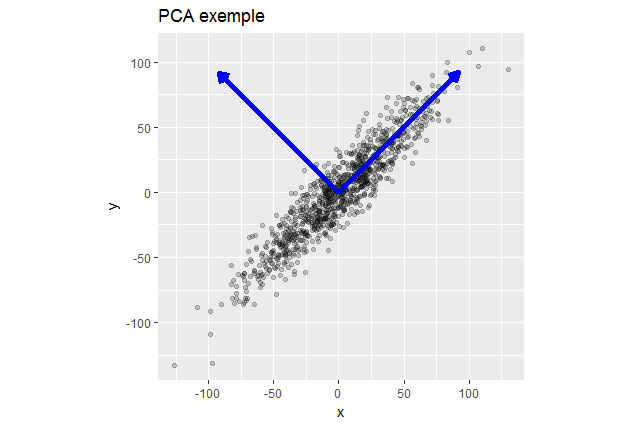

# PCA

## 주성분분석(PCA)

PCA는 데이터의 분산(variance)을 최대한 보존하면서 서로 직교하는 새 기저(축)를 찾아, 고차원 공간의 표본들을 선형 연관성이 없는 저차원 공간으로 변환하는 기법입니다.

```{r echo = FALSE}

```

그림에서 알 수 있듯이, 2차원 공간에 있는 데이터들이 하나의 주성분(PC1)을 새로운 기저로 선형변환된 걸 확인할 수 있습니다. 여기에서 1시 방향의 사선축이 원 데이터의 분산을 최대한 보존하는 새로운 기저입니다. 두 번째 성분은 첫 번째 성분의 방향에 직각인 방향으로 분산을 최대화하는 선형 결합을 선택하는 식으로 만들며, 그 후 성분들도 변수 수만큼 같은 방법으로 만듭니다. PCA의 목적은 바로 이런 축을 찾는 데 있습니다.

## iris 데이터 분석

먼저 R의 기본 데이터인 iris 데이터를 통해 PCA 분석을 해보도록 합니다.

### 데이터 불러오기

```{r}
library(magrittr)
library(corrplot)

data("iris")
iris.scale = iris[, 1:4] %>%
  scale()

iris.scale %>%
  cor() %>%
  corrplot.mixed()
```

먼저 데이터를 평균 0, 표준편차 1로 표준화한 후, 상관관계를 구합니다. Petal.Width와 Petal.Length 간, Sepal.Length와 Petal.Length 간에 높은 상관관계가 있습니다.

### 모형화

PCA는 다음 단계를 거친다.

1. 성분 추출 및 남길 성분의 수 결정
2. 남은 성분을 회전
3. 회전된 결과를 해석
4. 요인 점수를 생성
5. 요인 점수를 입력 변수로 사용해 회귀 분석을 하고, 테스트 데이터에 관한 평가

R에서는 기본함수인 `prcomp()`, `princomp()` 함수를 통해 PCA 분석을 수행할 수 있으며, `psych` 패키지를 통해 더욱 다양한 분석을 할 수 있습니다. 먼저 기본함수인 `prcomp()` 함수를 이용해 성분을 추출합니다.

```{r}
pca.iris = prcomp(iris.scale)
summary(pca.iris)
```

Cumulative Proportion을 살펴보면, PC1 만으로도 73% 가량의 분산을 설명하며, PC 2까지는 95%의 분산을 설명합니다.

몇번째 성분까지 사용하는 것이 좋은지를 판단하기 위해 screeplot을 그려주도록 합니다.

```{r}
screeplot(pca.iris, type = "l")
```

흔히 기울기가 달라지며 꺽이는 지점을 Elbow Point라고 부르는데 보통 이 부분의 PC까지를 사용해서 변수를 축소합니다. 2개 성분만으로도 충분하며, 3개 성분으로 대부분을 설명할 수 있습니다.

이번에는 `biplot()` 함수를 이용해 행렬도를 그려보도록 합니다.

```{r}
biplot(pca.iris)
```

위 그림은 각 개체에 대한 첫번째, 두번째 성분에 대한 점수 및 행렬도를 나타낸 것으로써, 가까운 거리와 방향일수록 변수들의 상관성이 높습니다. 

마지막으로 각 성분에 대한 기여도를 출력합니다.

```{r}
pca.iris$rotation
```

## 북미 프로 아이스하키 리그 데이터 분석

북미 프로 아이스하키 리그에 관한 데이터를 분석합니다.

### 데이터 불러오기

해당 데이터는  https://github.com/datameister66/data 에서 nhlTrain.csv와 nhlTest.csv 데이터를 다운받도록 합니다.

```{r}
train = read.csv('https://raw.githubusercontent.com/datameister66/data/master/NHLtrain.csv')
test = read.csv('https://raw.githubusercontent.com/datameister66/data/master/NHLtest.csv')
```

각 피처는 다음과 같습니다.

- Team: 팀의 연고지
- ppg: 게임당 점수의 평균
- Goals_For: 팀의 경기당 평균 득점
- Goals_Against: 팀의 경기당 평균 실점
- Shots_For: 경기당 팀의 골 근처에서 슛을 한 횟수
- Shots_Against: 경기당 팀이 골 근처에서 상대팀의 슛을 허용한 횟수
- PP_perc: 파워플레이 상황에서 팀이 득점한 퍼센트
- PK_perc: 상대팀이 파워플레이 상황일 때 실점을 하지 않은 시간의 퍼센트
- CF60_pp: 팀의 파워플레이 60분당 Corsi 점수. Corsi 점수는 Shots_For와 상대에게 막힌 것이나 네트를 벗어난 것의 개수를 합한 것이다.
- CA60_sh: 상대 팀의 파워플레이 60분당 Corsi 점수
- OZFOperc_pp: 팀이 파워플레이 상황일 때 공격자 지역에서 시합이 재개된 퍼센트
- Give: 팀이 경기당 퍽을 준 평균 횟수
- Take: 팀이 경기당 퍽을 가져온 평균 횟수
- hits: 팀의 경기당 보디체크 평균 횟수
- blks: 팀의 경기당 상대방 슛을 블로키한 횟수의 평균

데이터를 평균 0, 표준편차 1로 표준화한 후, 상관관계를 구하도록 합니다.

```{r}
library(magrittr)

train.scale = scale(train[, -1:-2])
nhl.cor = cor(train.scale)
nhl.cor %>% corrplot()
```

### 성분 추출

```{r}
library(psych)

pca = principal(train.scale, rotate = 'none')
plot(pca$values, type = 'b', ylab = 'Eigenvalues', xlab = 'Component')
```

`psych` 패키지의 `principal()` 함수를 통해 성분을 추출하도록 합니다. 5개 성분만으로도 충분한 설명력이 있는 것으로 보입니다.

### 직각 회전과 해석

회전의 목적은 특정한 성분에 관해 변수의 기여도를 최대화함으로써 각 성분 사이의 상관 관계를 줄여 해석을 간단학 하는 것입니다.

```{r}
pca.rotate = principal(train.scale, nfactors = 5, rotate = 'varimax')
print(pca.rotate)
```

먼저 각 5개 성분에 관한 변수들의 기여도는 RC1부터 RC5까지 열로 구분되어 있습니다. RC1(성분1)은 **Goals_Against**와 **Shots_Against** 변수의 성분에 관한 기여도가 높은 양의 값이고, **PP_perc**와 **PK_perc** 변수의 기여도가 높은 음의 값입니다.

RC2(성분2)은 **Goals_For** 변수가 높은 기여도를 가지고 있으며, RC5는 **Shots_For, CF60_pp, OZFOperc_pp**가 높은 기여도를 갖고 있습니다. RC3는 **take** 변수만 연관이 있으며, RC4는 **hits** 변수와 연관이 있습니다.

SS loadings 제곱합으로 시작하는 표의 숫자는 각 성분의 고윳값(Eigenvalue) 입니다. 이 고윳값이 정규화되면 Proportion Explained 행의 값이며, 성분 1이 5개의 회전된 성분 모두가 설명하는 분산의 28%를 설명하는 것을 볼 수 있습니다.

경험적으로 선택된 성분들이 설명하는 분산의 총합이 최소한 전체 분산의 70%를 넘어야 하며, Cumulative Var 행의 5개 성분 합이 총 74%의 분산을 나타내고 있습니다.

### 요인 점수 생성

회전된 성분들의 기여도를 각 팀의 요인 점수로 변환합니다.

```{r}
pca.scores = data.frame(pca.rotate$scores)
head(pca.scores)
```

독립변수(png)를 데이터의 열로 불러오도록 합니다.

```{r}
pca.scores$ppg = train$ppg
```

### 회귀 분석

```{r}
nhl.lm = lm(ppg ~ ., data = pca.scores)
summary(nhl.lm)
```

$R^2$가 70%에 달하며, p값이 1.446e-06로 나와 통계적으로 높은 유의성을 갖고 있습니다. 그러나 RC1과 RC2를 제외한 3개 성분은 유의하지 않은 것으로 보입니다. 두 가지 피처만을 대상으로 회귀분석을 다시 실시합니다.

```{r}
nhl.lm2 = lm(ppg ~ RC1 + RC2, data = pca.scores)
summary(nhl.lm2)
```

$R^2$가 역시나 70%에 가까우며, 통계적으로 유의한 모델입니다.

```{r}
plot(nhl.lm2$fitted.values, train$ppg,
     xlab = 'Predicted',
     ylab = 'Actual')
```

```{r}
sqrt(mean(nhl.lm2$residuals^2))
```

평균 제곱 오차의 제곱근을 계산한 후 테스트 셋과 비교해보도록 합니다.

```{r}
test.scores = data.frame(predict(pca.rotate, test[, c(-1:-2)]))

test.scores$pred = predict(nhl.lm2, test.scores)
test.scores$ppg = test$ppg
```

```{r}
plot(test.scores$pred, test.scores$ppg,
     xlab = 'Predicted',
     ylab = 'Actual')
```

```{r}
resid = test.scores$ppg - test.scores$pred
sqrt(mean(resid^2))
```