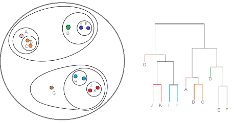

# 군집화 분석

군집화 분석의 목적은 관찰된 값을 일정 숫자의 집단으로 나누는 것입니다. 이 집단 사이에는 서로 최대한 다른 관찰값을 가지되, 한 집단에 소속된 관찰값은 최대한 비슷하도록 나누어야 합니다.

군집화 분석은 크게 두가지 방법이 쓰입니다.

- K-평균 군집화 기법(K-means): 원하는 군집의 개수인 k를 지정하면, 알고리즘은 각 관찰값이 k개의 군집 중 하나의 군집에만 속할 때까지 반복을 계속합니다.

```{r echo = FALSE, out.width = '50%'}
knitr::include_graphics('images/K-means_convergence.gif')
```

해당 알고리즘의 작동 순서는 다음과 같습니다.

1. 만들고자 하는 군집의 개수(k)를 지정합니다.
2. 시작 평균으로 사용될 k개의 점들을 임의로 초기화합니다.
3. 다음의 내용을 반복합니다.
a.  각 관찰값을 가장 가까운 군집에 할당하는 방식으로 k개의 군집을 만듭니다. (군집 내 분산을 최소화)
b. 각 군집의 중점이 새로운 평균이 됩니다.
c. 각 군집의 중점이 더 이상 변하지 않을 때까지 이 과정을 반복합니다.

- 계층적 군집화 기법(hierarchical): 관찰값 사이의 비유사성 측정값을 기반으로 군집화를 합니다. 일반적으로 비유사성에는 유클리드 거리가 사용됩니다.

$$ dist(x,y) = \sqrt{\sum_{i=1}^n(x_i - yi)^2} $$

```{r echo = FALSE}

```

## K-Means (iris 데이터)

먼저 R의 기본 데이터인 iris 데이터를 통해 K-means 분석을 해보도록 합니다.

```{r echo = FALSE}
knitr::include_graphics('images/iris.png')
```

### 데이터 불러오기 및 편집

```{r}
set.seed(1234)

data(iris)
table(iris$Species)
```

iris 데이터는 총 3가지 종류의 클래스로 구분되어 있습니다.

```{r}
iris_km = iris[, 1:4]
iris_km = data.frame(scale(iris_km))
```

비지도 학습을 위해 label 피쳐를 제거한 피처를 선택합니다. 그 후 `scale()` 함수를 이용해 표준화를 해주도록 합니다.


```{r}
library(ggplot2)
library(magrittr)

iris_km %>%
  ggplot(aes(x = Petal.Length, y = Petal.Width)) +
  geom_point()
```

군집화 이전 Petal.Length와 Petal.Width를 점도표로 나타내 봅니다.

```{r}
iris_kmeans = kmeans(iris_km, centers = 3, iter.max = 10000)
print(iris_kmeans)
```

`kmeans()` 함수를 통해 군집화를 수행할 수 있으며, centers 인자를 통해 몇개의 군집으로 나눌지 선택할 수 있습니다. 1~3개 군집에 각각 50, 53개, 47개 데이터가 선택되었습니다. 이를 그림으로 나타내보도록 합니다.

```{r}
iris_km$cluster = as.factor(iris_kmeans$cluster)

iris_km %>%
  ggplot(aes(x = Petal.Length, y = Petal.Width)) +
  geom_point(aes(color = cluster))
```

실제 데이터와 비교해보도록 하겠습니다. 1번 군집은 setosa, 2번 군집은 versicolor, 3번 군집은 virginica와 매칭됩니다.

```{r}
iris_km$culster = ifelse(iris_km$cluster == 1, 'setosa', 
                         ifelse(iris_km$cluster == 2, 'versicolor',
                                'virginica'))
caret::confusionMatrix(as.factor(iris_km$culster), as.factor(iris$Species))  
```

setosa는 완벽하게 구분했지만 versicolor와 virginica를 구분하는데는 오류가 있어, 약 83% 정도의 정확도를 보입니다.

## 와인 데이터 분석

178개 와인의 화학 조성을 나타내는 13개 변수를 통해 군집화를 하도록 하겠습니다.

### 데이터 불러오기 및 편집

```{r}
library(HDclassif)  

data(wine)
str(wine)
```

각 피처는 다음과 같습니다.

- V1: 알콜
- V2: 말산
- V3: 재
- V4: 재의 알칼리성
- V5: 마그네슘
- V6: 페놀 총량
- V7: 플라보노이드
- V8: 비플라보노이드성 페놀
- V9: 프로안토시아닌
- V10: 색의 강도
- V11: 빛깔
- V12: OD280/OD315
- V13: 프롤린

변수의 이름을 정해준 후, 표준화를 실시합니다. 또한 비지도 학습을 위해 label인 Class는 제거해주도록 합니다.

```{r}
names(wine) = c('Class', 'Alcohol', 'MalicAcid', 'Ash', 'Alk_ash', 'magnesium', 'T_phenols', 'flavonoids', 'Non_flav', 'Proantho', 'C_Intensity', 'Hue', '00280_315', 'Proline')

df = as.data.frame(scale(wine[, -1]))
```

품종(class)의 분포를 살펴보도록 하겠습니다.

```{r}
table(wine$Class)
```

각 품종에 골고루 분포되어 있는 모습입니다.

### K-평균 군집화

`NbClust()` 함수를 이용해 최적의 군집 수를 찾을 수 있습니다.

```{r}
library(NbClust)

numKmeans = NbClust(df, min.nc = 2, max.nc = 15, method = 'kmeans')
```

결과를 보면 3개의 군집이 최적 숫자인 것으로 판명됩니다. 해당 k를 바탕으로 `kmeans()` 함수를 이용해 K-평균 군집화 분석을 수행합니다. nstart 인자는 초기 임의 군집을 몇개 생성할지를 정하는 값입니다.

```{r}
set.seed(1234)
km = kmeans(df, 3, nstart = 25)

table(km$cluster)
```

원 데이터의 class와 비교를 통해  정확도를 평가해보도록 합니다.

```{r}
caret::confusionMatrix(as.factor(km$cluster), as.factor(wine$Class))
```

0.9663의 높은 정확도를 보입니다.

### 계층적 군집화

위와 동일하게 `NbClust()` 함수 내 인자를 바꾸어, 계층적 군집화 기준 최적의 군집 수를 찾도록 합니다.

```{r}
numComplete = NbClust(df, distance  = 'euclidean', min.nc = 2, max.nc = 6, method = 'complete', index = 'all')
```

역시나 3개의 군집이 최적으로 나타납니다. 이제 3개의 군집을 사용해 거리 행렬을 계산하도록 합니다.

```{r}
dis = dist(df, method = 'euclidean')
```

해당 행렬을 `hclust()` 함수의 입력값으로 사용해 군집화를 합니다.

```{r}
hc = hclust(dis, method = 'complete')
plot(hc, hang = -1, labels = FALSE)
```

`cutree()` 함수를 이용해 군집을 나눈후, sparcl 패키지의 `cutree()` 함수를 이용하면 군집을 시각화할 수 있습니다.

```{r}
library(sparcl)

comp3 = cutree(hc, 3)
ColorDendrogram(hc, y = comp3, branchlength = 50)
```

각 군집 별로 색이 다르게 나타납니다. 마지막으로 원 데이터의 class와 비교를 통해 정확도를 계산해보도록 합니다.

```{r}
caret::confusionMatrix(as.factor(comp3), as.factor(wine$Class))
```

0.8371의 정확도를 보입니다.