# 회귀분석

## 상관관계 이해하기

먼저 R에서 제공하는 기본 데이터를 불러옵니다.


```r
data(anscombe)
attach(anscombe)
head(anscombe)
```

```
##   x1 x2 x3 x4   y1   y2    y3   y4
## 1 10 10 10  8 8.04 9.14  7.46 6.58
## 2  8  8  8  8 6.95 8.14  6.77 5.76
## 3 13 13 13  8 7.58 8.74 12.74 7.71
## 4  9  9  9  8 8.81 8.77  7.11 8.84
## 5 11 11 11  8 8.33 9.26  7.81 8.47
## 6 14 14 14  8 9.96 8.10  8.84 7.04
```

각 변수의 상관관계를 살펴보도록 합니다.


```r
cor(x1, y1)
```

```
## [1] 0.8164
```

```r
cor(x2, y2)
```

```
## [1] 0.8162
```

둘 간의 상관관계는 0.8164로 동일합니다. 이를 그림으로 확인해보도록 합니다.


```r
par(mfrow = c(2, 2))
plot(x1, y1, main = 'Plot 1')
plot(x2, y2, main = 'Plot 2')
plot(x3, y3, main = 'Plot 3')
plot(x4, y4, main = 'Plot 4')
```

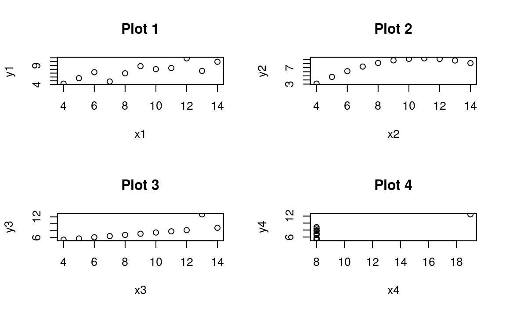

Plot 1은 선형관계를, Plot 2는 곡선 모양을, Plot 3은 특이점이, Plot 4는 특이점 하나만이 상관관계가 있는것 처럼 보입니다. 이처럼 상관관계에만 전적으로 의존하면 제대로 된 결과를 확인할 수 없습니다.

## 회귀의 이해

회귀분석의 식은 다음과 같이 나타납니다.

$y = a + bx$

- $y$: 종속변수
- $x$: 독립변수
- $b$: 기울기. $x$가 증가할 때마다 직선이 얼마나 올라가는지를 명시
- $a$: 절편. 직선이 세로 $y$축과 교차하는 지점을 명시

### 보통 최소 제곱(OLS) 추정

OLS 회귀의 목표는 다음 방정식을 최소화하는 작업입니다.

- $\sum(y_i - \hat{y_i})^2 = \sum{e_i}^2$

즉 실제 값과 예측 값의 차로 $e$(오차)를 정의됩니다.

$\bar{y} = a + b\bar{x}$에서 다음식이 유도됩니다.

- $a = \bar{y} - b\bar{x}$
- $b = \frac{\sum(x_i - \bar{x})(y_i - \bar{y})}{\sum(x_i - \bar{x})^2}$
- $Var(x) = \frac{\sum(x_i - \bar{x})^2}{n}$
- $Cov(x,y) = \frac{\sum(x_i - \bar{x})(y_i - \bar{y})}{n}$

따라서 b는 다음과 같이 나타낼 수 있습니다.

- $b = \frac{Cov(x,y)}{Var(x)}$

R에서 해당 계수는 `lm()` 함수를 이용해 손쉽게 추정할 수 있습니다.

## 단변량 회귀분석

### 챌린저 호 데이터

미국 우주왕복선 챌린저가 로켓 부스터 고장으로 분해되면서 일곱 명의 승무원이 사망했으며, 잠재 요인으로 발사 온도가 의심되었습니다. 로켓 연결 부분의 밀봉을 담당하는 패킹용 고무 오링이 40°F 미만에서는 테스트되지 않았었고, 발사일의 날씨가 평소와 달리 매우 춥고 영하(31°F)인 상태였기 때문입니다.

다음 데이터는 온도에 따른 오링의 손상여부 테스트 데이터입니다.


```r
challenger = read.csv('http://www.math.usu.edu/~symanzik/teaching/2009_stat6560/RDataAndScripts/sharif_abbass_project1_challenger.csv')

plot(challenger$temperature, challenger$r,
     xlab = 'Temp', ylab = 'Damage', pch = 1)
abline(v = 65)
```

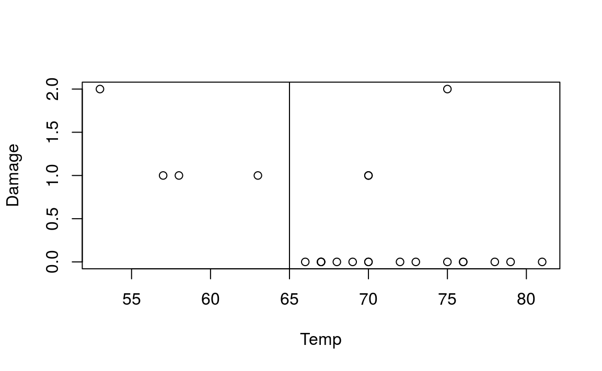

고온에서 발사될 때 오링의 손상 이벤트가 적어지는 경향이 있습니다. 회귀분석을 통해 둘간의 관계를 살펴보도록 합니다.


```r
reg.challenger= lm(r ~ temperature, data = challenger)
summary(reg.challenger)
```

```
## 
## Call:
## lm(formula = r ~ temperature, data = challenger)
## 
## Residuals:
##     Min      1Q  Median      3Q     Max 
## -0.5608 -0.3944 -0.0854  0.1056  1.8671 
## 
## Coefficients:
##             Estimate Std. Error t value Pr(>|t|)   
## (Intercept)   3.6984     1.2195    3.03   0.0063 **
## temperature  -0.0475     0.0174   -2.73   0.0127 * 
## ---
## Signif. codes:  0 '***' 0.001 '**' 0.01 '*' 0.05 '.' 0.1 ' ' 1
## 
## Residual standard error: 0.577 on 21 degrees of freedom
## Multiple R-squared:  0.261,	Adjusted R-squared:  0.226 
## F-statistic: 7.43 on 1 and 21 DF,  p-value: 0.0127
```

temperature의 회귀계수가 -0.05로써 온도와 손상 이벤트 간에는 역의 관계가 있음이 보입니다. 당시 온도인 31°F를 대입하면 오링의 예상 손상 이벤트는 $3.69841 + 31 \times (-0.04754) = 2.22467$ 이 됩니다.

회귀분석 결과를 그림으로 확인해보도록 하겠습니다.


```r
plot(challenger$temperature, challenger$r,
     xlab = 'Temp', ylab = 'Damage', pch = 1)
abline(reg.challenger, lwd = 3, col = 'red')
```

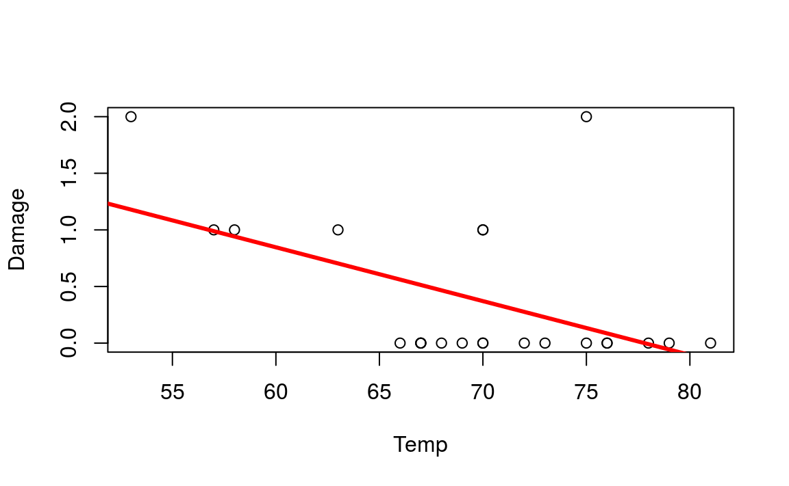

### 미국 와이오밍 주 용출량 예측

미국 와이오밍 주 스네이크 강 유역의 용출량을 예측변수, 해당 연도 눈의 강우량을 이용하여 예측합니다. 먼저 해당 데이터를 그림으로 나타내봅니다.


```r
library(alr3)
data(snake)
colnames(snake) = c('content', 'yield')
head(snake)
```

```
##   content yield
## 1    23.1  10.5
## 2    32.8  16.7
## 3    31.8  18.2
## 4    32.0  17.0
## 5    30.4  16.3
## 6    24.0  10.5
```

```r
plot(snake, xlab = 'water content of snow',
     ylab = 'water yield')
```

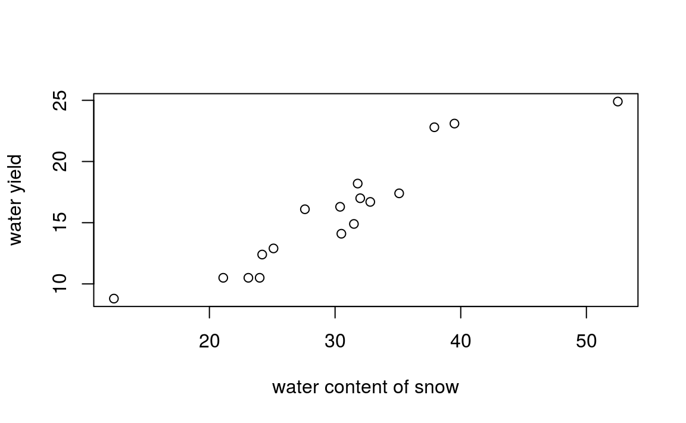

양 끝에 특이점 두개가 있습니다. 다음으로 `lm()` 함수를 이용해 단변량 회귀분석을 실행합니다.


```r
reg = lm(yield ~ content, data = snake)
summary(reg)
```

```
## 
## Call:
## lm(formula = yield ~ content, data = snake)
## 
## Residuals:
##    Min     1Q Median     3Q    Max 
## -2.179 -1.515 -0.362  1.628  3.197 
## 
## Coefficients:
##             Estimate Std. Error t value    Pr(>|t|)    
## (Intercept)   0.7254     1.5488    0.47        0.65    
## content       0.4981     0.0495   10.06 0.000000046 ***
## ---
## Signif. codes:  0 '***' 0.001 '**' 0.01 '*' 0.05 '.' 0.1 ' ' 1
## 
## Residual standard error: 1.74 on 15 degrees of freedom
## Multiple R-squared:  0.871,	Adjusted R-squared:  0.862 
## F-statistic:  101 on 1 and 15 DF,  p-value: 0.0000000463
```

content 변수가 유의미한 변수임이 확인됩니다. 다음으로 산포도에 회귀식을 그려보도록 하겠습니다.


```r
plot(snake, xlab = 'water content of snow',
     ylab = 'water yield')
abline(reg, lwd = 3, col = 'red')
```

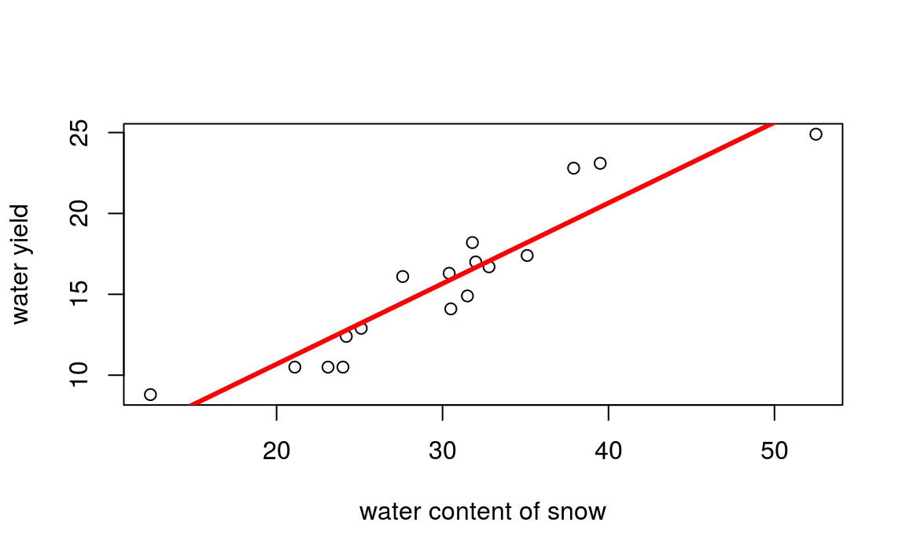

회귀분석의 가정은 다음과 같습니다.

- 선형성(linearity): 독립 변수(x)와 종속 변수(y) 사이에 선형적 관계
- 오류항의 비상관(non-correlation): 오류항 사이에 상관관계가 없음
- 등분산성(homoscedasticity): 오류항은 정규분포를 따르며 일정한 분산을 가짐. 이 가정을 위배되면 이분산성(heteroscedasticity)
- 비공선성(non-collinearity): 두 예측 변수 사이에도 선형적인 관계가 있으면 안됨
- 특이점의 부재(absence of outliers): 특이점이 있으면 추정값이 심하게 왜곡될 수 있음

회귀분석 결과에 `plot()` 함수를 입력하여 해당 가정을 확인할 수 있습니다.


```r
par(mfrow = c(2, 2))
plot(reg)
```

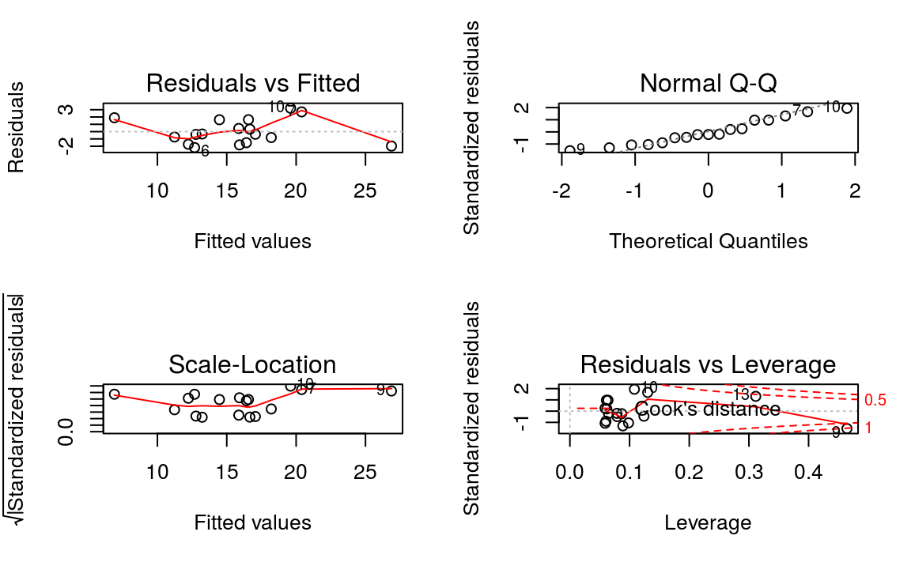

car 패키지의 `qqPlot()` 함수를 통해 Q-Q 플롯의 신뢰구간을 확인할 수 있습니다.


```r
qqPlot(reg)
```

```
## [1]  7 10
```

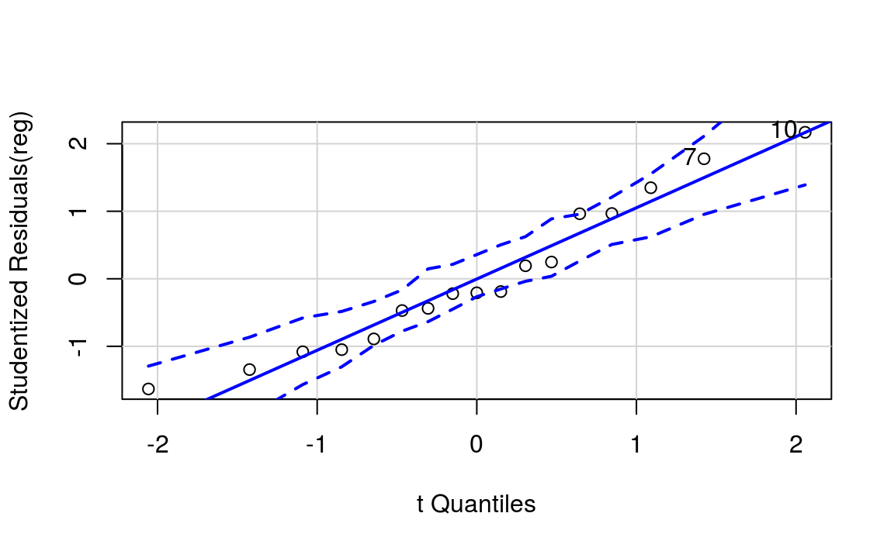

## 다변량 회귀분석

### 다이아몬드 데이터

다이아몬드 가격에 영향을 미치는 요소에 대해 회귀분석을 실시하도록 합니다.


```r
library(caret)

data(diamonds)
head(diamonds)
```

```
## # A tibble: 6 x 10
##   carat cut       color clarity depth table price     x     y     z
##   <dbl> <ord>     <ord> <ord>   <dbl> <dbl> <int> <dbl> <dbl> <dbl>
## 1 0.23  Ideal     E     SI2      61.5    55   326  3.95  3.98  2.43
## 2 0.21  Premium   E     SI1      59.8    61   326  3.89  3.84  2.31
## 3 0.23  Good      E     VS1      56.9    65   327  4.05  4.07  2.31
## 4 0.290 Premium   I     VS2      62.4    58   334  4.2   4.23  2.63
## 5 0.31  Good      J     SI2      63.3    58   335  4.34  4.35  2.75
## 6 0.24  Very Good J     VVS2     62.8    57   336  3.94  3.96  2.48
```

종속변수로 price, 독립변수로 caret, depth, table 피처를 사용하도록 하겠습니다.

- caret: 다이아몬드 무게
- depth: 깊이 비율, z / mean(x, y)
- table: 가장 넓은 부분의 너비 대비 다이아몬드 꼭대기의 너비


```r
reg.diamonds = lm(price ~ carat + depth + table, data = diamonds)
summary(reg.diamonds)
```

```
## 
## Call:
## lm(formula = price ~ carat + depth + table, data = diamonds)
## 
## Residuals:
##    Min     1Q Median     3Q    Max 
## -18288   -786    -33    527  12487 
## 
## Coefficients:
##             Estimate Std. Error t value Pr(>|t|)    
## (Intercept) 13003.44     390.92    33.3   <2e-16 ***
## carat        7858.77      14.15   555.4   <2e-16 ***
## depth        -151.24       4.82   -31.4   <2e-16 ***
## table        -104.47       3.14   -33.3   <2e-16 ***
## ---
## Signif. codes:  0 '***' 0.001 '**' 0.01 '*' 0.05 '.' 0.1 ' ' 1
## 
## Residual standard error: 1530 on 53936 degrees of freedom
## Multiple R-squared:  0.854,	Adjusted R-squared:  0.854 
## F-statistic: 1.05e+05 on 3 and 53936 DF,  p-value: <2e-16
```

price와 carat은 양의 관계, depth와 table은 음의 관계가 있습니다.

### 캘리포니아 물 가용량

캘리포니아 오웬스 벨리의 여섯 지점에서 측정한 강설량을 토대로 물 가용량을 예측해보도록 하겠습니다.


```r
data(water)
str(water)
```

```
## 'data.frame':	43 obs. of  8 variables:
##  $ Year   : int  1948 1949 1950 1951 1952 1953 1954 1955 1956 1957 ...
##  $ APMAM  : num  9.13 5.28 4.2 4.6 7.15 9.7 5.02 6.7 10.5 9.1 ...
##  $ APSAB  : num  3.58 4.82 3.77 4.46 4.99 5.65 1.45 7.44 5.85 6.13 ...
##  $ APSLAKE: num  3.91 5.2 3.67 3.93 4.88 4.91 1.77 6.51 3.38 4.08 ...
##  $ OPBPC  : num  4.1 7.55 9.52 11.14 16.34 ...
##  $ OPRC   : num  7.43 11.11 12.2 15.15 20.05 ...
##  $ OPSLAKE: num  6.47 10.26 11.35 11.13 22.81 ...
##  $ BSAAM  : int  54235 67567 66161 68094 107080 67594 65356 67909 92715 70024 ...
```

Year는 불필요한 변수이므로 삭제해주도록 합니다.


```r
socal.water = water[, -1]
head(socal.water)
```

```
##   APMAM APSAB APSLAKE OPBPC  OPRC OPSLAKE  BSAAM
## 1  9.13  3.58    3.91  4.10  7.43    6.47  54235
## 2  5.28  4.82    5.20  7.55 11.11   10.26  67567
## 3  4.20  3.77    3.67  9.52 12.20   11.35  66161
## 4  4.60  4.46    3.93 11.14 15.15   11.13  68094
## 5  7.15  4.99    4.88 16.34 20.05   22.81 107080
## 6  9.70  5.65    4.91  8.88  8.15    7.41  67594
```

각 변수들 간 상관관계를 살펴보도록 하겠습니다.


```r
library(corrplot)
water.cor = cor(socal.water)

print(water.cor)
```

```
##          APMAM   APSAB APSLAKE   OPBPC   OPRC OPSLAKE  BSAAM
## APMAM   1.0000 0.82769 0.81608 0.12239 0.1544 0.10754 0.2386
## APSAB   0.8277 1.00000 0.90030 0.03954 0.1056 0.02961 0.1833
## APSLAKE 0.8161 0.90030 1.00000 0.09345 0.1064 0.10059 0.2493
## OPBPC   0.1224 0.03954 0.09345 1.00000 0.8647 0.94335 0.8857
## OPRC    0.1544 0.10564 0.10638 0.86471 1.0000 0.91914 0.9196
## OPSLAKE 0.1075 0.02961 0.10059 0.94335 0.9191 1.00000 0.9384
## BSAAM   0.2386 0.18329 0.24934 0.88575 0.9196 0.93844 1.0000
```

```r
corrplot(water.cor)
```

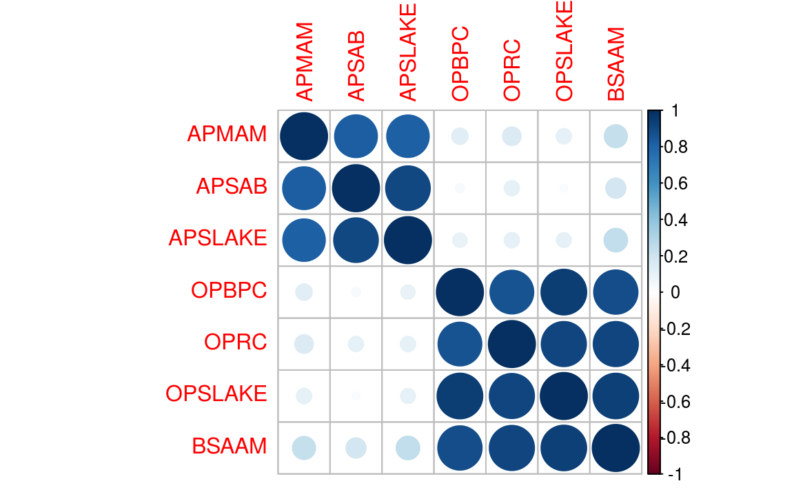

AP와 OP 변수들 간의 강한 상관관계가 존재하며, 다중 공선성 문제에 맞닥뜨릴 것이라는 사실을 알 수 있습니다.

`lm()` 함수를 통해 회귀분석을 실시하며, 독립변수로 모든 변수를 입력하고자 할 때는 변수를 모두 입력하는 대신 *y ~ .* 형태로 입력이 가능합니다.


```r
reg = lm(BSAAM ~ ., data = socal.water)
summary(reg)
```

```
## 
## Call:
## lm(formula = BSAAM ~ ., data = socal.water)
## 
## Residuals:
##    Min     1Q Median     3Q    Max 
## -12690  -4936  -1424   4173  18542 
## 
## Coefficients:
##             Estimate Std. Error t value Pr(>|t|)    
## (Intercept)  15944.7     4099.8    3.89  0.00042 ***
## APMAM          -12.8      708.9   -0.02  0.98572    
## APSAB         -664.4     1522.9   -0.44  0.66524    
## APSLAKE       2270.7     1341.3    1.69  0.09911 .  
## OPBPC           69.7      461.7    0.15  0.88084    
## OPRC          1916.5      641.4    2.99  0.00503 ** 
## OPSLAKE       2211.6      752.7    2.94  0.00573 ** 
## ---
## Signif. codes:  0 '***' 0.001 '**' 0.01 '*' 0.05 '.' 0.1 ' ' 1
## 
## Residual standard error: 7560 on 36 degrees of freedom
## Multiple R-squared:  0.925,	Adjusted R-squared:  0.912 
## F-statistic: 73.8 on 6 and 36 DF,  p-value: <2e-16
```

### 최적화를 통한 변수 선택

변수 선택에는 크게 두가지 방법이 있습니다.

- 단계적 전방 선택법(forward stepwise selection): 피처가 하나도 없는 모형에서 시작해, 피처를 한 번에 하나씩 더해 모든 피처가 포함될 때까지 계속한다. 잔차 제곱합(RSS)이 제일 작은 피처를 선택

- 단계적 후방 회귀분석(backward stepwise regression): 모형에 모든 피처를 더해 놓고 시작해 가장 덜 유용한 피처를 한 번에 하나씩 제거

두 방법 모두 편향된 회귀 계수를 생성할 수 있으므로, **최량 부분 집합 회귀 분석법(best subsets regression)**을 실시힙합니다. 이는 가능한 모든 피처의 조합을 이용해 모형을 적합화합니다. leaps 패키지의 `regsubsets()` 함수를 통해 최량 부분 집합 회귀를 수행할 수 있습니다.


```r
library(leaps)

reg.sub = regsubsets(BSAAM ~ ., data = socal.water)
best.summary = summary(reg.sub)

best.summary$rss
```

```
## [1] 3264010454 2600641788 2068947585 2057133378 2055849271 2055830733
```

```r
which.min(best.summary$rss)
```

```
## [1] 6
```

피처가 6개 일때 RSS가 가장 낮음이 보입니다. 그러나 피처를 더하면 더할 수록 RSS는 감소하고 $R^2$는 증가하기 마련입니다. 따라서 피처 선택을 위해 여러 기준을 살펴봐야 합니다. 

- $AIC = n \times log(\frac{RSS_p}{n}) + 2 \times p$ <br>  $p$: 테스트하고 있는 모형의 피처 수

- $C_p = \frac{RSS_p}{MSE_f} - n + 2 \times p$ <br>  $MSE_t$: 모든 피처를 포함한 모형의 평균 제곱 오차 <br> $n$: 표본 크기

- $BIC = n \times log \frac{RSS_p}{n} + p \times log(n)$

- $Adjusted\ R^2 = 1 - \frac{RSS}{n-p-1} / \frac{R^2}{n-1}$

선형 모형에서 AIC와 Cp는 서로 비례하므로 Cp만 살펴보도록 하며, Cp는 leaps 패키지로 출력할 수 있습니다.


```r
plot(best.summary$cp, xlab = 'number of features', ylab = 'cp')
```

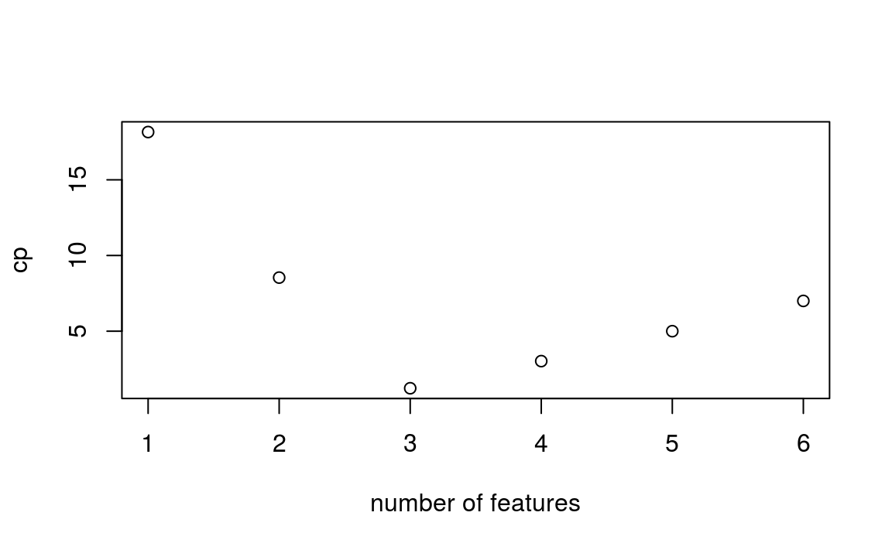

피처가 3개로 구성된 모형이 가장 작은 Cp 값을 가집니다.


```r
plot(reg.sub, scale = 'Cp')
```

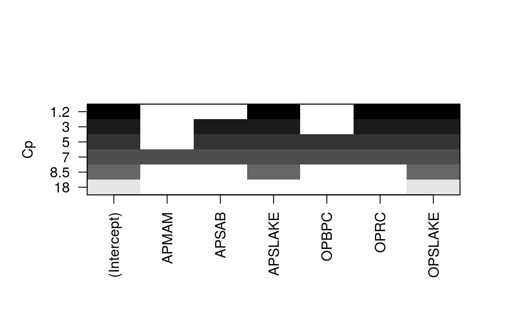

가장 작은 Cp 값을 제공하는 피처를 나타내고 있으며 **APSLAKE, OPRC, OPSLAKE**가 이 모형에 포함된 피처들입니다.

위에서 선택된 피처만으로 다중 회귀분석을 실시하도록 하겠습니다.


```r
reg.best = lm(BSAAM ~ APSLAKE + OPRC + OPSLAKE, data = socal.water) 
summary(reg.best)
```

```
## 
## Call:
## lm(formula = BSAAM ~ APSLAKE + OPRC + OPSLAKE, data = socal.water)
## 
## Residuals:
##    Min     1Q Median     3Q    Max 
## -12964  -5140  -1252   4446  18649 
## 
## Coefficients:
##             Estimate Std. Error t value  Pr(>|t|)    
## (Intercept)    15425       3638    4.24   0.00013 ***
## APSLAKE         1712        500    3.42   0.00148 ** 
## OPRC            1798        568    3.17   0.00300 ** 
## OPSLAKE         2390        447    5.35 0.0000042 ***
## ---
## Signif. codes:  0 '***' 0.001 '**' 0.01 '*' 0.05 '.' 0.1 ' ' 1
## 
## Residual standard error: 7280 on 39 degrees of freedom
## Multiple R-squared:  0.924,	Adjusted R-squared:  0.919 
## F-statistic:  159 on 3 and 39 DF,  p-value: <2e-16
```

3개의 피처만으로 회귀분석한 $R^2$가 0.9185로써, 전체 피처로 회귀분석한 $R^2$인 0.9123 대비 증가합니다.


```r
par(mfrow = c(2, 2))
plot(reg.best)
```

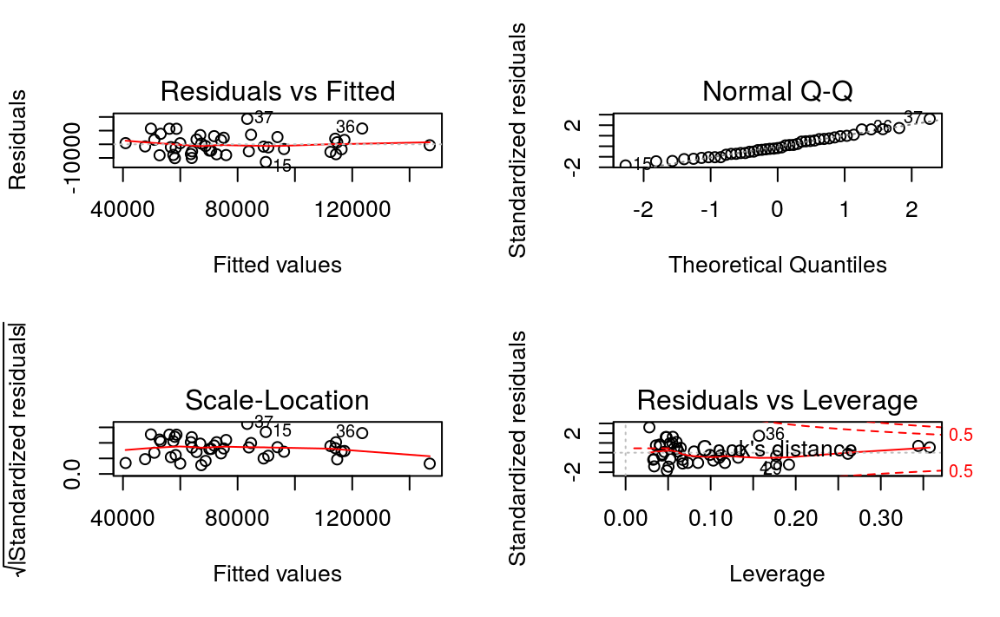

### Robustness Check

회귀분석의 가정이 맞는지 강건성 체크를 해보도록 하겠습니다.

#### 다중공선성

다중공선성(multicollinearity) 여부를 조사하기 위해서는 분산 팽창 인자(VIF: Variance inflation factor) 통계량을 사용해야 합니다. VIF는 모든 피처가 들어 있는 전체 모형을 적합화할 때 계산된 특정한 피처 계수의 분산과 그 피처만 들어 있는 부분 모형으로 적합화했을 때의 계수 분산의 비율입니다.

$$VIF = 1 / (1 - R^2_i)$$

car 패키지의 `vif()` 함수를 통해 해당 값을 계산할 수 있습니다.


```r
vif(reg.best)
```

```
## APSLAKE    OPRC OPSLAKE 
##   1.011   6.453   6.445
```

OPRC과 OPSLAKE의 vif가 매우 높게 나오며, 이는 OPRC와 OPSLAKE 간 상관관계가 지나치게 높기 때문입니다.


```r
plot(socal.water$OPRC, socal.water$OPSLAKE,
     xlab = 'OPRC', ylab = 'OPSLAKE')
```

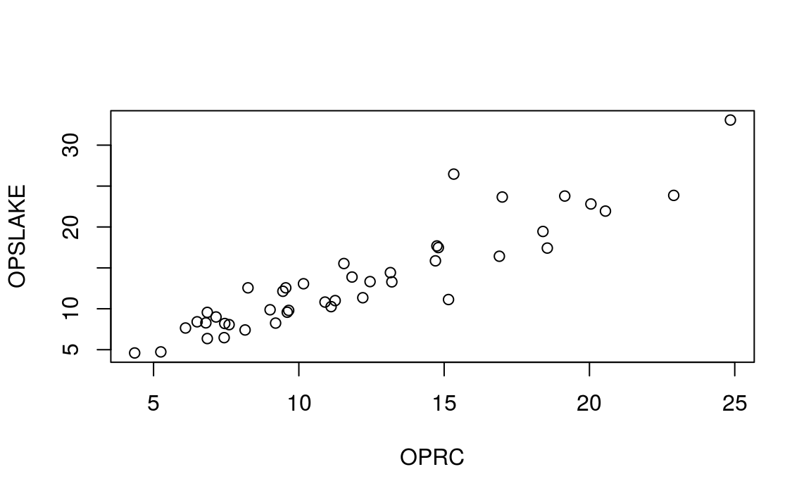

따라서 둘 중 하나의 변수를 탈락시키는 것이 좋습니다.


```r
best.summary$adjr2
```

```
## [1] 0.8778 0.9002 0.9185 0.9169 0.9147 0.9123
```

변수가 2개인 경우 $R^2$는 0.900이며, 3개인 경우 $R^2$는 0.918여서 증가가 경미합니다. 변수 2개로만 이뤄진 모형의 가정을 점검합니다.


```r
fit.2 = lm(BSAAM ~ APSLAKE + OPSLAKE, data = socal.water)
summary(fit.2)
```

```
## 
## Call:
## lm(formula = BSAAM ~ APSLAKE + OPSLAKE, data = socal.water)
## 
## Residuals:
##    Min     1Q Median     3Q    Max 
## -13336  -5893   -172   4220  19500 
## 
## Coefficients:
##             Estimate Std. Error t value Pr(>|t|)    
## (Intercept)    19145       3812    5.02 0.000011 ***
## APSLAKE         1769        554    3.19   0.0027 ** 
## OPSLAKE         3690        196   18.83  < 2e-16 ***
## ---
## Signif. codes:  0 '***' 0.001 '**' 0.01 '*' 0.05 '.' 0.1 ' ' 1
## 
## Residual standard error: 8060 on 40 degrees of freedom
## Multiple R-squared:  0.905,	Adjusted R-squared:   0.9 
## F-statistic:  190 on 2 and 40 DF,  p-value: <2e-16
```

```r
par(mfrow = c(2, 2))
plot(fit.2)

vif(fit.2)
```

```
## APSLAKE OPSLAKE 
##    1.01    1.01
```

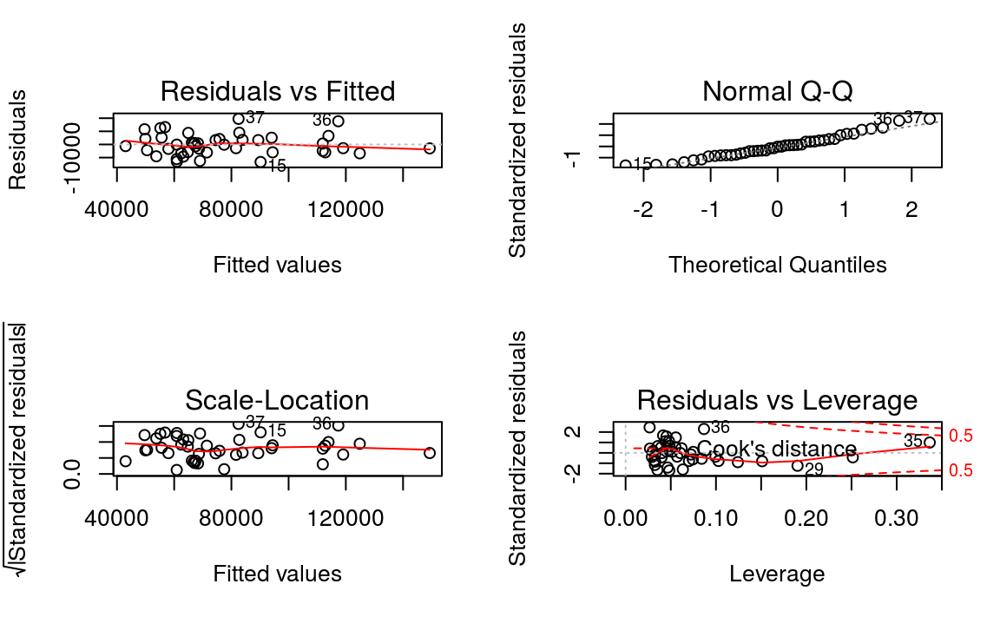

#### 등분산성

등분산성에 여부는 브루시-페이건(Breusch-Pagan, BP) 테스트를 통해 확인이 가능하며, lmtest 패키지의 `bptest()` 함수를 이용합니다.


```r
library(lmtest)
bptest(fit.2)
```

```
## 
## 	studentized Breusch-Pagan test
## 
## data:  fit.2
## BP = 0.0046, df = 2, p-value = 1
```

BP 테스트의 귀무가설과 대립가설은 다음과 같습니다

- 귀무가설: "오차항은 등분산성을 띤다"
- 대립가설: "오차항은 이분산성을 띤다" 

p 값이 0.9977로 매우크므로 귀무가설을 기각할 근거가 부족해, 오차항은 등분산을 띤다는 것을 알 수 있습니다.

### 실제와 예측간의 차이

**model$fitted.values**에는 모델을 통해 나온 예측값이 있으므로, 실제 값과 차이를 살펴볼 수 있습니다.


```r
plot(fit.2$fitted.values, socal.water$BSAAM, 
     xlab = 'predicted', ylab = 'actual', main = 'Predicted vs. Actual')
```

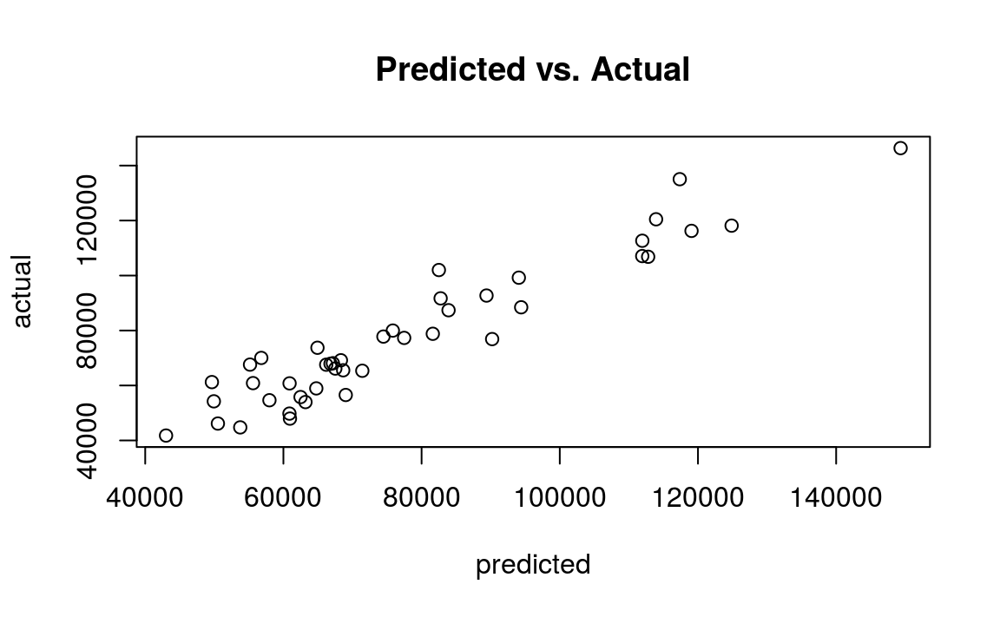

ggplot을 이용 이용하면 더욱 깔끔하게 이를 나타낼 수 있다.


```r
library(ggplot2)
library(magrittr)

socal.water['Actual'] = water$BSAAM
socal.water$Forecast = predict(fit.2)

socal.water %>%
  ggplot(aes(x = Forecast, y = Actual)) + 
  geom_point() +
  geom_smooth(method = 'lm', se = FALSE) +
  labs(title = 'Forecast vs. Actuals')
```

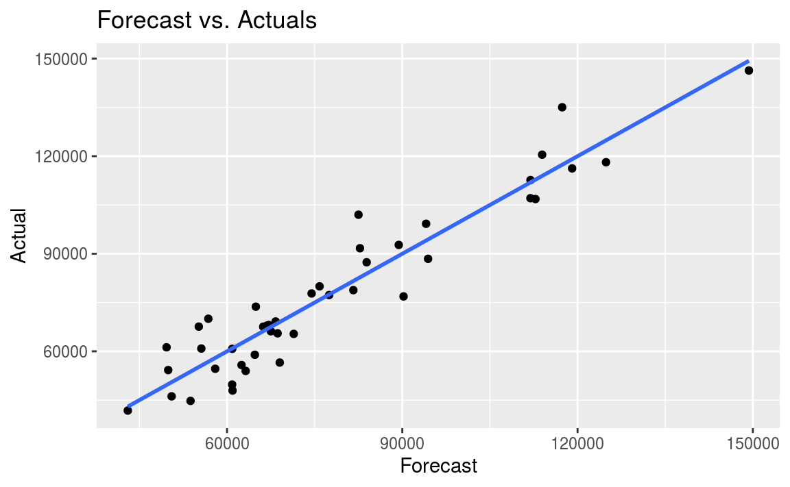

## 다른 고려사항

### 질적 피처

질적 피처(qualitative feature)에서는 남성/여성 또는 나쁨/중간/좋음 등 2개나 그 이상의 단계를 정할 수 있습니다.

예를 들어 성별처럼 두 가지 단계를 갖는 피처가 있다면, 지표 혹은 더미 피처라는 변수를 만들어 임의로 단계 하나는 0, 다른 하나는 1로 줄 수 있습니다. 지표만을 이용해 모형을 만들어도 여전히 선형 모형은 기존 식과 같습니다.

$$Y = B_0 + B_1x + e$$

피처가 남성일 때 0, 여성일 때 1로 할당할 경우, 남성의 기대값은 $y$ 절편인 $B_0$이고, 여성의 기대값은 $B_0 + B_1x$ 입니다. R 내에서 factor 형태로 된 피처를 사용할 경우 자동으로 질적 피처로 계산이 됩니다.

예제로 ISLR 패키지의 Carseats 데이터 세트를 사용하도록 합니다.


```r
library(ISLR)
data(Carseats)
str(Carseats)
```

```
## 'data.frame':	400 obs. of  11 variables:
##  $ Sales      : num  9.5 11.22 10.06 7.4 4.15 ...
##  $ CompPrice  : num  138 111 113 117 141 124 115 136 132 132 ...
##  $ Income     : num  73 48 35 100 64 113 105 81 110 113 ...
##  $ Advertising: num  11 16 10 4 3 13 0 15 0 0 ...
##  $ Population : num  276 260 269 466 340 501 45 425 108 131 ...
##  $ Price      : num  120 83 80 97 128 72 108 120 124 124 ...
##  $ ShelveLoc  : Factor w/ 3 levels "Bad","Good","Medium": 1 2 3 3 1 1 3 2 3 3 ...
##  $ Age        : num  42 65 59 55 38 78 71 67 76 76 ...
##  $ Education  : num  17 10 12 14 13 16 15 10 10 17 ...
##  $ Urban      : Factor w/ 2 levels "No","Yes": 2 2 2 2 2 1 2 2 1 1 ...
##  $ US         : Factor w/ 2 levels "No","Yes": 2 2 2 2 1 2 1 2 1 2 ...
```

해당 데이터 중 정량적 피처인 광고(Advertising)과 질적 피처인 진열대 위치(ShelveLoc)만을 이용해 카시트(Carseats)의 판매량을 예측합니다. 이 중 진열대 위치는 Bad, Good, Medium 총 3개 level로 구성되어 있습니다.


```r
sales.fit = lm(Sales ~ Advertising + ShelveLoc, data = Carseats)
summary(sales.fit)
```

```
## 
## Call:
## lm(formula = Sales ~ Advertising + ShelveLoc, data = Carseats)
## 
## Residuals:
##    Min     1Q Median     3Q    Max 
## -6.648 -1.620 -0.048  1.531  6.410 
## 
## Coefficients:
##                 Estimate Std. Error t value Pr(>|t|)    
## (Intercept)       4.8966     0.2521   19.43  < 2e-16 ***
## Advertising       0.1007     0.0169    5.95  5.9e-09 ***
## ShelveLocGood     4.5769     0.3348   13.67  < 2e-16 ***
## ShelveLocMedium   1.7514     0.2748    6.37  5.1e-10 ***
## ---
## Signif. codes:  0 '***' 0.001 '**' 0.01 '*' 0.05 '.' 0.1 ' ' 1
## 
## Residual standard error: 2.24 on 396 degrees of freedom
## Multiple R-squared:  0.373,	Adjusted R-squared:  0.369 
## F-statistic: 78.6 on 3 and 396 DF,  p-value: <2e-16
```

진열대 위치가 좋은 경우(ShelveLocGood)는 위치가 나쁜 경우의 판매량인 Intercept 값인  4.89662 대비 4.57686이 더 높습니다.

### 상호작용 항

어떤 피처가 예측에 미치는 영향이 또 다른 피처에 종속적일 경우, 이 두 피처는 서로 상호작용한다고 말합니다.

$$Y = B_0 + B_1x + B_2 + B_1B_2x + e$$

MASS 패키지의 Boston 데이터 세트를 이용해 상호작용 회귀분석을 살펴보도록 하겠습니다.


```r
library(MASS)
data(Boston)
str(Boston)
```

```
## 'data.frame':	506 obs. of  14 variables:
##  $ crim   : num  0.00632 0.02731 0.02729 0.03237 0.06905 ...
##  $ zn     : num  18 0 0 0 0 0 12.5 12.5 12.5 12.5 ...
##  $ indus  : num  2.31 7.07 7.07 2.18 2.18 2.18 7.87 7.87 7.87 7.87 ...
##  $ chas   : int  0 0 0 0 0 0 0 0 0 0 ...
##  $ nox    : num  0.538 0.469 0.469 0.458 0.458 0.458 0.524 0.524 0.524 0.524 ...
##  $ rm     : num  6.58 6.42 7.18 7 7.15 ...
##  $ age    : num  65.2 78.9 61.1 45.8 54.2 58.7 66.6 96.1 100 85.9 ...
##  $ dis    : num  4.09 4.97 4.97 6.06 6.06 ...
##  $ rad    : int  1 2 2 3 3 3 5 5 5 5 ...
##  $ tax    : num  296 242 242 222 222 222 311 311 311 311 ...
##  $ ptratio: num  15.3 17.8 17.8 18.7 18.7 18.7 15.2 15.2 15.2 15.2 ...
##  $ black  : num  397 397 393 395 397 ...
##  $ lstat  : num  4.98 9.14 4.03 2.94 5.33 ...
##  $ medv   : num  24 21.6 34.7 33.4 36.2 28.7 22.9 27.1 16.5 18.9 ...
```

이 중 사용할 피처의 설명은 다음과 같습니다.

- medv: 주택 가치의 중위값
- lstat: 낮은 사회 경제적 지위를 갖는 가구의 백분율
- age: 주택의 연령

`lm()` 함수에 $feature1 * feature2$를 쓰면, 각 피처뿐만 아니라 두 피처의 상호작용 항도 모형에 포함됩니다.


```r
value.fit = lm(medv ~ lstat * age, data = Boston)
summary(value.fit)
```

```
## 
## Call:
## lm(formula = medv ~ lstat * age, data = Boston)
## 
## Residuals:
##    Min     1Q Median     3Q    Max 
## -15.81  -4.04  -1.33   2.08  27.55 
## 
## Coefficients:
##              Estimate Std. Error t value Pr(>|t|)    
## (Intercept) 36.088536   1.469835   24.55  < 2e-16 ***
## lstat       -1.392117   0.167456   -8.31  8.8e-16 ***
## age         -0.000721   0.019879   -0.04    0.971    
## lstat:age    0.004156   0.001852    2.24    0.025 *  
## ---
## Signif. codes:  0 '***' 0.001 '**' 0.01 '*' 0.05 '.' 0.1 ' ' 1
## 
## Residual standard error: 6.15 on 502 degrees of freedom
## Multiple R-squared:  0.556,	Adjusted R-squared:  0.553 
## F-statistic:  209 on 3 and 502 DF,  p-value: <2e-16
```

lstat은 매우 예측력이 높은 피처이며, age는 예측력이 높지 않습니다. 그러나 이 두 피처는 유의한 상호작용을 보이며, medv를 설명하는 변수입니다.
