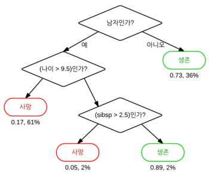
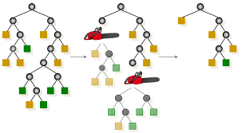
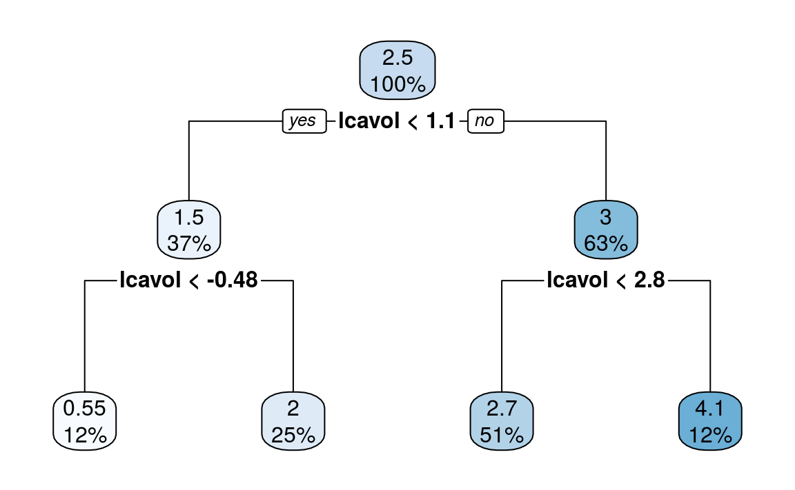
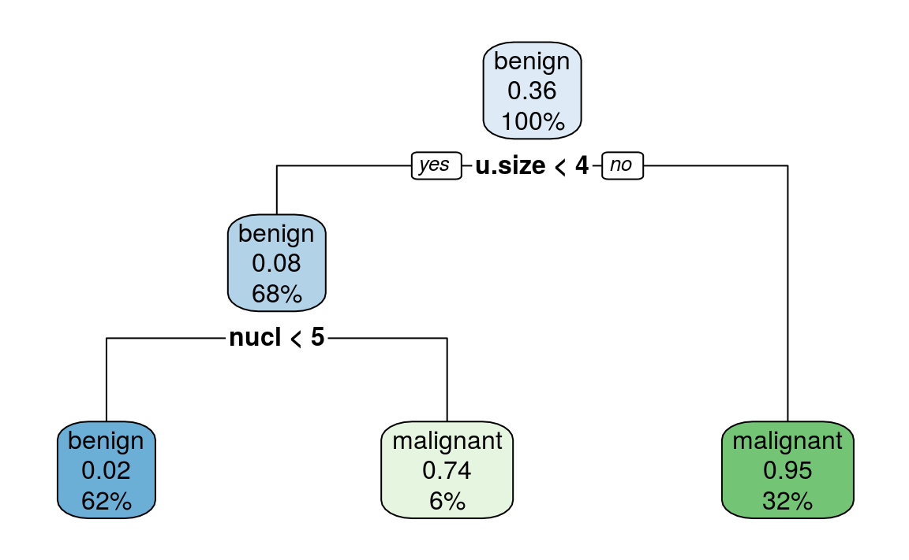
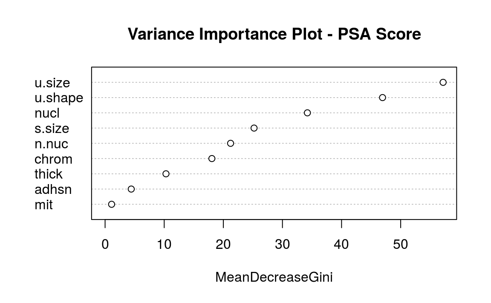
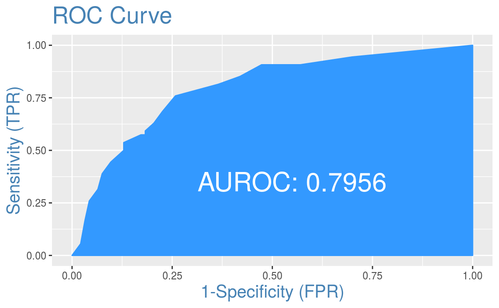

# CART

## 의사결정나무

의사결정나무는 특정 항목에 대한 의사 결정 규칙을 나무 형태로 분류해 나가는 분석 기법을 말합니다. 예를 들어, 타이타닉 호 탑승자의 성별, 나이, 자녀의 수를 이용해서 생존 확률을 아래와 같이 구분해 나갑니다.



의사결정나무의 가장 큰 장점은 분석 과정을 실제로 눈으로 관측할 수 있으므로 직관적이고 이해하기 쉽다는 점입니다. 

또한 수치형/범주형 변수를 모두 사용할 수 있다는 점, 계산 비용이 낮아 대규모의 데이터 셋에서도 비교적 빠르게 연산이 가능하다는 장점이 있습니다.

의사결정나무 분석 방법에는 통계학에 기반한 (카이스퀘어, T검정, F검정 등을 사용한) CART 및 CHAID 알고리즘이나, 기계학습 계열인(엔트로피, 정보 이득 등을 사용한) ID3, C4.5, C5.0 등의 알고리즘이 존재하며, 일반적으로 CART를 많이 사용합니다.

### 랜덤 포레스트

모형의 예측력을 높이기 위해서는 많은 트리를 만들고 결과를 결합하면 되며, 이를 랜덤 포레스트라 합니다.


랜덤 포레스트 기법에서는 크게 두 가지 방법을 사용합니다.

1. 부트스트랩(bootstrap aggregation) 혹은 배깅(bagging)은 전체 관찰값 3분의 2 정도의 데이터 집합에서 무작위로 샘플을 선정해 트리는 만듭니다.

2. 개별 분할에서 입력 피처를 무작위로 선정하는 방법입니다. R 패키지에서는 기본적으로 회귀 분석 문제를 풀 때는 전체 예측 변수 수를 3으로 나눈 값($n / 3$)을, 분류 문제를 풀 때는 전체 예측 변수 수의 제곱근 한 값을 ($\sqrt{n}$)  사용합니다.

### 익스트림 그레디언트 부스트 기법 (XGboost)

부스트 기법은 기본 모형을 만든 후 잔차를 검사하고 손실함수에 맞춰 해당 잔차를 바탕으로 모형을 적합하게 만들며, 이는 특정 기준에 이를 때까지 계속 반복하는 방법입니다.

예를 들어 학생이 연습 시험을 봐서 100문제 중에 30문제를 틀린 경우 해당 30문제만 다시 공부하며, 다음 시험에서 30문제 중 10개를 틀리면 다시 10문제만 집중하는 과정입니다.

## 회귀 트리

먼저 CART 모형을 이용하여 회귀 트리를 만드는 법을 살펴보도록 하겠습니다.

### 데이터 불러오기 및 편집

이전에 사용한 암-전립선암 데이터를 불러옵니다. 


```r
library(ElemStatLearn)

data(prostate)
prostate$gleason = ifelse(prostate$gleason == 6, 0, 1)
pros.train = subset(prostate, train == TRUE)[, 1:9]
pros.test = subset(prostate, train == FALSE)[, 1:9]
```

gleason이 6이면 0, 그렇지 않으면 1로 변형해주며, 트레인과 테스트 셋을 각각 나누어줍니다.

### 모형화

R에서는 rpart 패키지의 `rpart()` 함수를 이용해 회귀 트리를 만들 수 있습니다.


```r
set.seed(123)

library(rpart)

tree.pros = rpart(lpsa ~ ., data = pros.train)
print(tree.pros)
```

```
## n= 67 
## 
## node), split, n, deviance, yval
##       * denotes terminal node
## 
##  1) root 67 96.280 2.452  
##    2) lcavol< 1.051 25 24.820 1.522  
##      4) lcavol< -0.4786 8  5.374 0.546 *
##      5) lcavol>=-0.4786 17  8.234 1.981 *
##    3) lcavol>=1.051 42 36.950 3.006  
##      6) lcavol< 2.792 34 21.290 2.749  
##       12) lweight< 3.463 12  7.788 2.222 *
##       13) lweight>=3.463 22  8.349 3.036  
##         26) age>=65 15  5.694 2.891 *
##         27) age< 65 7  1.660 3.347 *
##      7) lcavol>=2.792 8  3.820 4.101 *
```

lpsa를 나누는 기준의 트리가 생성되었습니다. 이를 보기 쉽게 그림으로 나타내보도록 하겠습니다.


```r
library(rpart.plot)

rpart.plot(tree.pros)
```


해당 모형을 통한 회귀분석을 통해 MSE을 구하도록 합니다.


```r
library(magrittr)

party.test = predict(tree.pros, newdata = pros.test)
party.resid = (party.test - pros.test$lpsa) %>%
  .^2 %>% mean()

print(party.resid)
```

```
## [1] 0.6136
```

MSE 값이 0.6136 입니다.

### 프루닝(가지치기)

가지수가 많아질수록 트레이닝 셋에서의 설명력은 높아지지만, 오버피팅이 발생할 수 있으므로 적절하게 가지수를 제한할 필요가 있습니다.



먼저 cptable을 통해 모델의 각종 결과값을 확인하고 이를 통해 적절한 가지수를 찾도록 합니다.


```r
print(tree.pros$cptable)
```

```
##        CP nsplit rel error xerror    xstd
## 1 0.35852      0    1.0000 1.0196 0.17964
## 2 0.12296      1    0.6415 0.8742 0.12878
## 3 0.11640      2    0.5185 0.7949 0.10420
## 4 0.05351      3    0.4021 0.7905 0.09822
## 5 0.01033      4    0.3486 0.7044 0.09116
## 6 0.01000      5    0.3383 0.7322 0.09382
```

cptable의 내용은 다음과 같다.

- CP: 비용 복잡도(complexity parameter)
- nsplit: 트리의 분할 횟수
- rel error: 분할 횟수에 다른 RSS의 값을 분할하지 않았을 때의 RSS 값으로 나눔. $RSS(k) / RSS(0)$
- xerror: 10겹 교차검증의 평균오차
- xstd: 10겹 교차검증의 표준편차

`plotcp()` 함수를 이용해 이를 그림으로 나타낼 수도 있습니다.


```r
plotcp(tree.pros)
```


일반적으로 선 하단에 위치한 포인트 중 가장 왼쪽에 위치한 값을 선택하는 것이 좋습니다. 오른쪽으로 갈수록 Error율은 낮아지지만 가지수가 많아지기 때문입니다. 위 그림을 통해 CP가 4(3번 분할)을 선택하도록 합니다.


```r
cp = min(tree.pros$cptable[4, ]) # select cp
prune.tree.pros = prune(tree.pros, cp)
```

`prune()` 함수를 이용해 가지를 친 트리를 만들 수 있습니다.


```r
rpart.plot(prune.tree.pros)
```



가치지기를 통해 lcavol 변수만 남게 되었습니다.

해당 모형을 테스트 셋에 적용해보도록 합니다.


```r
party.pros.test = predict(prune.tree.pros, newdata = pros.test)
rpart.resid = (party.pros.test - pros.test$lpsa) %>%
  .^2 %>% mean()

print(rpart.resid)
```

```
## [1] 0.5145
```

MSE가 0.5145로써, 가지치기 전 대비 다소 줄어들었습니다.

### 랜덤 포레스트: 회귀 트리 

먼저 회귀분석 트리를 대상으로 랜덤 포레스트 방법을 적용합니다. R에서는 `randomForest()` 함수를 이용해 랜덤 포레스트 모델을 만들 수 있습니다.


```r
library(randomForest)

set.seed(123)
rf.pros = randomForest(lpsa ~., data = pros.train)
rf.pros
```

```
## 
## Call:
##  randomForest(formula = lpsa ~ ., data = pros.train) 
##                Type of random forest: regression
##                      Number of trees: 500
## No. of variables tried at each split: 2
## 
##           Mean of squared residuals: 0.6937
##                     % Var explained: 51.73
```

랜덤 포레스트 기법에서는 매 분할마다 2개의 변수를 샘플링해 500개의 각기 다른 트리를 생성하며, MSE는 0.6937 입니다.

트리가 너무 많아지면 과적합이 발생할 수도 있으므로, rf.pros를 그림으로 그려보도록 합니다.


```r
plot(rf.pros)
```


트리수가 100개가 넘어가면 MSE에 큰 변화가 없는 모습입니다. `which.min()` 함수를 통해 최적의 트리를 찾아보도록 합니다.


```r
which.min(rf.pros$mse)
```

```
## [1] 80
```

```r
set.seed(123)
rf.pros.2 = randomForest(lpsa ~ ., data = pros.train,
                         ntree = which.min(rf.pros$mse))

rf.pros.2
```

```
## 
## Call:
##  randomForest(formula = lpsa ~ ., data = pros.train, ntree = which.min(rf.pros$mse)) 
##                Type of random forest: regression
##                      Number of trees: 80
## No. of variables tried at each split: 2
## 
##           Mean of squared residuals: 0.6567
##                     % Var explained: 54.31
```

MSE가 가장 낮은 80개의 트리로 랜덤포레스트를 수행한 결과, MSE가 0.6567로 개선되었습니다.

다음으로 변수의 중요도를 살펴보도록 한다.


```r
varImpPlot(rf.pros.2, scale = T, 
           main = 'Variance Importance Plot - PSA Score')

importance(rf.pros.2)
```

```
##         IncNodePurity
## lcavol         25.012
## lweight        15.822
## age             7.167
## lbph            5.471
## svi             8.498
## lcp             8.114
## gleason         4.990
## pgg45           6.664
```


위 모델(트리 갯수를 줄인 모댈)을 테스트 셋에 적용해보도록 합니다.


```r
rf.pros.test = predict(rf.pros.2, newdata = pros.test)
rf.resid = (rf.pros.test - pros.test$lpsa) %>%
  .^2 %>% mean()
print(rf.resid)
```

```
## [1] 0.5513
```

MSE 값이 기존에 비해 훨씬 줄어들었습니다.


Table: (\#tab:unnamed-chunk-19)각 모형의 MSE 비교

      모형           MSE   
-----------------  --------
    기본 트리       0.6136 
    가지치기        0.5145 
  랜덤 포레스트     0.6937 
 랜덤 포레스트 2    0.6567 


## 분류 트리

이번에는 CART 모형을 이용하여 분류 트리를 만드는 법을 살펴보도록 하겠습니다.

### 데이터 불러오기 및 편집

위스콘신 유방암 데이터를 불러온 후, 데이터를 나누도록 합니다.


```r
library(MASS)

data(biopsy)

biopsy$ID = NULL
names(biopsy) = c('thick', 'u.size', 'u.shape', 'adhsn', 's.size',
                  'nucl', 'chrom', 'n.nuc', 'mit', 'class')
biopsy.v2 = na.omit(biopsy)

set.seed(123)
ind = sample(2, nrow(biopsy.v2), replace = TRUE,
             prob = c(0.7, 0.3))

biop.train = biopsy.v2[ind==1, ]
biop.test = biopsy.v2[ind==2, ]
```

`rpart()` 함수를 이용해 트리 모형을 수행합니다. class가 benign과 malignant로 구성된 factor 형태이므로, 분류 트리가 만들어집니다.


```r
set.seed(123)
tree.biop = rpart(class ~ ., data = biop.train)
print(tree.biop)
```

```
## n= 474 
## 
## node), split, n, loss, yval, (yprob)
##       * denotes terminal node
## 
##  1) root 474 172 benign (0.63713 0.36287)  
##    2) u.size< 3.5 321  27 benign (0.91589 0.08411)  
##      4) nucl< 4.5 294   7 benign (0.97619 0.02381) *
##      5) nucl>=4.5 27   7 malignant (0.25926 0.74074)  
##       10) thick< 3.5 8   3 benign (0.62500 0.37500) *
##       11) thick>=3.5 19   2 malignant (0.10526 0.89474) *
##    3) u.size>=3.5 153   8 malignant (0.05229 0.94771) *
```

cptable을 살펴보도록 합니다.


```r
tree.biop$cptable
```

```
##        CP nsplit rel error xerror    xstd
## 1 0.79651      0    1.0000 1.0000 0.06086
## 2 0.07558      1    0.2035 0.2616 0.03710
## 3 0.01163      2    0.1279 0.1512 0.02882
## 4 0.01000      3    0.1163 0.1512 0.02882
```

```r
plotcp(tree.biop)
```


cptable과 그림을 살펴본 결과, cp가 3(2번분할) 한 모델을 적용하도록 합니다.


```r
cp = min(tree.biop$cptable[3, ])
prune.tree.biop = prune(tree.biop, cp = cp)
rpart.plot(prune.tree.biop)
```



트리 결과를 살펴보면 u.size가 첫 번째 분할이며, nuci가 두 번째 분할 기준입니다. 위 모델을 test 데이터에 적용해보도록 합니다.


```r
rpart.test = predict(prune.tree.biop, newdata = biop.test, type = 'class')
caret::confusionMatrix(rpart.test, biop.test$class)
```

```
## Confusion Matrix and Statistics
## 
##            Reference
## Prediction  benign malignant
##   benign       136         3
##   malignant      6        64
##                                       
##                Accuracy : 0.957       
##                  95% CI : (0.92, 0.98)
##     No Information Rate : 0.679       
##     P-Value [Acc > NIR] : <2e-16      
##                                       
##                   Kappa : 0.902       
##                                       
##  Mcnemar's Test P-Value : 0.505       
##                                       
##             Sensitivity : 0.958       
##             Specificity : 0.955       
##          Pos Pred Value : 0.978       
##          Neg Pred Value : 0.914       
##              Prevalence : 0.679       
##          Detection Rate : 0.651       
##    Detection Prevalence : 0.665       
##       Balanced Accuracy : 0.956       
##                                       
##        'Positive' Class : benign      
## 
```

두 번의 분할 트리 모형만으로도 95.69%의 정확도를 얻을 수 있습니다.

변수의 중요도를 살펴보도록 합니다.

### 랜덤 포레스트: 분류 트리

`randomForest()` 함수를 이용해 랜덤 포레스트 모델을 적용합니다.


```r
set.seed(123)
rf.biop = randomForest(class ~ ., data = biop.train)
rf.biop
```

```
## 
## Call:
##  randomForest(formula = class ~ ., data = biop.train) 
##                Type of random forest: classification
##                      Number of trees: 500
## No. of variables tried at each split: 3
## 
##         OOB estimate of  error rate: 3.38%
## Confusion matrix:
##           benign malignant class.error
## benign       294         8     0.02649
## malignant      8       164     0.04651
```

OOB(out of bag) 오차율은 0.0338 로 나타납니다. 다음으로 트리 수에 따른 오차를 그린 후, err.rate가 최소가 되는 트리 갯수를 찾도록 합니다.


```r
plot(rf.biop)
```


```r
which.min(rf.biop$err.rate[, 1])
```

```
## [1] 125
```

해당 트리 갯수 만큼 랜덤 포레스트를 다시 만듭니다.


```r
set.seed(123)
rf.biop.2 = randomForest(class ~., data = biop.train,
                         ntree = which.min(rf.biop$err.rate[, 1]))
print(rf.biop.2)
```

```
## 
## Call:
##  randomForest(formula = class ~ ., data = biop.train, ntree = which.min(rf.biop$err.rate[,      1])) 
##                Type of random forest: classification
##                      Number of trees: 125
## No. of variables tried at each split: 3
## 
##         OOB estimate of  error rate: 2.95%
## Confusion matrix:
##           benign malignant class.error
## benign       294         8     0.02649
## malignant      6       166     0.03488
```

에러가 0로 기존에 비해 감소하였습니다. 이제 해당 모델을 테스트 셋에 적용합니다.


```r
rf.biop.test = predict(rf.biop.2, newdata = biop.test, type = 'class')
caret::confusionMatrix(rf.biop.test, biop.test$class)
```

```
## Confusion Matrix and Statistics
## 
##            Reference
## Prediction  benign malignant
##   benign       138         0
##   malignant      4        67
##                                         
##                Accuracy : 0.981         
##                  95% CI : (0.952, 0.995)
##     No Information Rate : 0.679         
##     P-Value [Acc > NIR] : <2e-16        
##                                         
##                   Kappa : 0.957         
##                                         
##  Mcnemar's Test P-Value : 0.134         
##                                         
##             Sensitivity : 0.972         
##             Specificity : 1.000         
##          Pos Pred Value : 1.000         
##          Neg Pred Value : 0.944         
##              Prevalence : 0.679         
##          Detection Rate : 0.660         
##    Detection Prevalence : 0.660         
##       Balanced Accuracy : 0.986         
##                                         
##        'Positive' Class : benign        
## 
```

test 데이터를 상대로 98% 이상의 정확도를 나타내며, 단일 트리에 훨씬 개선된 성과를 보입니다. 이처럼 랜덤 포레스트는 회귀 트리 보다는 분류 트리에서 더욱 뛰어난 성능 개선을 보입니다.

변수의 중요도를 살펴보도록 합니다.


```r
varImpPlot(rf.biop.2, scale = T, 
           main = 'Variance Importance Plot - PSA Score')

importance(rf.biop.2)
```

```
##         MeanDecreaseGini
## thick             10.301
## u.size            57.177
## u.shape           46.932
## adhsn              4.425
## s.size            25.199
## nucl              34.220
## chrom             18.064
## n.nuc             21.229
## mit                1.103
```



## 익스트림 그레디언트 부스트 기법 (XGboost)

### 데이터 불러오기 및 편집

먼저 피마 인디어 당뇨병 모형 데이터를 불러온 후, 트레이닝과 테스트 셋으로 나눠주도록 합니다.


```r
data(Pima.tr)
data(Pima.te)
pima = rbind(Pima.tr, Pima.te)

set.seed(502)
ind = sample(2, nrow(pima), replace = TRUE, prob = c(0.7, 0.3))
pima.train = pima[ind == 1, ]
pima.test = pima[ind == 2, ]
```

### 랜덤 포레스트 

먼저 비교를 위해 랜덤포레스트를 이용한 분류 모형을 만들도록 합니다.


```r
set.seed(321)
rf.pima = randomForest(type ~ ., data = pima.train)
rf.pima
```

```
## 
## Call:
##  randomForest(formula = type ~ ., data = pima.train) 
##                Type of random forest: classification
##                      Number of trees: 500
## No. of variables tried at each split: 2
## 
##         OOB estimate of  error rate: 20.26%
## Confusion matrix:
##      No Yes class.error
## No  235  27      0.1031
## Yes  51  72      0.4146
```

20% 가량의 오분류가 발생하였습니다. 트리 크기 최적화를 통한 성능 개선여부를 살펴보도록 합니다.


```r
which.min(rf.pima$err.rate[, 1])
```

```
## [1] 88
```

```r
set.seed(321)
rf.pima.2 = randomForest(type ~ ., data = pima.train,
                         ntree = which.min(rf.pima$err.rate[, 1]))

print(rf.pima.2)
```

```
## 
## Call:
##  randomForest(formula = type ~ ., data = pima.train, ntree = which.min(rf.pima$err.rate[,      1])) 
##                Type of random forest: classification
##                      Number of trees: 88
## No. of variables tried at each split: 2
## 
##         OOB estimate of  error rate: 19.74%
## Confusion matrix:
##      No Yes class.error
## No  236  26     0.09924
## Yes  50  73     0.40650
```

오류율이 역시 20% 정도로써 모델이 크게 개선되지는 않습니다. 해당 모형을 테스트 셋에 적용해보도록 합니다.


```r
rf.pima.test = predict(rf.pima.2, newdata = pima.test, type = 'class')
caret::confusionMatrix(rf.pima.test, pima.test$type)
```

```
## Confusion Matrix and Statistics
## 
##           Reference
## Prediction No Yes
##        No  74  17
##        Yes 19  37
##                                         
##                Accuracy : 0.755         
##                  95% CI : (0.677, 0.822)
##     No Information Rate : 0.633         
##     P-Value [Acc > NIR] : 0.00105       
##                                         
##                   Kappa : 0.477         
##                                         
##  Mcnemar's Test P-Value : 0.86763       
##                                         
##             Sensitivity : 0.796         
##             Specificity : 0.685         
##          Pos Pred Value : 0.813         
##          Neg Pred Value : 0.661         
##              Prevalence : 0.633         
##          Detection Rate : 0.503         
##    Detection Prevalence : 0.619         
##       Balanced Accuracy : 0.740         
##                                         
##        'Positive' Class : No            
## 
```

75% 가량의 정확도를 보입니다. 이처럼 해당 데이터에는 랜덤포레스트 기법을 적용하여도 모델이 크게 개선되지 않습니다.

### XGboost 모형 만들기

XGboost 모형 적용을 위해, 먼저 다음과 같이 그리드를 만들도록 합니다.


```r
grid = expand.grid(
  nrounds = c(75, 100),
  colsample_bytree = 1,
  min_child_weight = 1,
  eta = c(0.01, 0.1, 0.3),
  gamma = c(0.5, 0.25),
  subsample = 0.5,
  max_depth = c(2,3)
)
```

위에서 입력한 인자값의 내용은 다음과 같습니다.

- nrounds: 최대 반복 횟수(최종 모형에서의 트리 수)
- colsample_bytree: 트리를 생성할 때 표본 추출한 피처 수(비율로 표시), 기본값은 1(피처 수의 100%)
- min_child_weight: 부스트되는 트리에서 최소 가중값. 기본값은 1
- eta: 학습 속도. 해법에 관한 각 트리의 기여도를 의미. 기본값은 0.3
- gamma: 트리에서 다른 리프 분할을 하기 위해 필요한 최소 손실 감소(minimum loss reduction)
- subsample: 데이터 관찰값의 비율. 기본값은 1(100%)
- max_depth: 개별 트리의 최대 깊이

다음은 `trainControl()` 함수를 이용하여 인자를 지정합니다.


```r
library(caret)

cntrl = trainControl(
  method = 'cv',
  number = 5,
  verboseIter = FALSE, # TRUE 설정시 과정이 보임
  returnData = FALSE,
  returnResamp = 'final'
)
```

먼저 최적화된 인자를 구하도록 합니다. trControl와 tuneGrid는 위에서 입력한 인자를 입력한다.


```r
set.seed(1)

train.xgb = train(
  x = pima.train[, 1:7],
  y = pima.train[, 8],
  trControl = cntrl,
  tuneGrid = grid,
  method = 'xgbTree'
)

print(train.xgb)
```


모형 생성을 위한 최적 인자들의 조합이 출력됩니다.

다음으로 `xgb.train()` 함수에서 사용할 인자 목록(param)에 위에서 출력된 값을 입력합니다.

그 후 데이터 프레임을 입력 피처의 행렬을 x로, 레이블을 0과 1로 변환한 값을 y로 입력한 후, x와 y를 `xgb.Dmatrix()` 함수에서 입력값으로 사용합니다.


```r
library(xgboost)

param = list(
  objective = 'binary:logistic',
  eval_metric = 'error',
  eta = 0.01,
  max_depth = 2,
  subsample = 0.5,
  comsample_byree = 1,
  gamma = 0.5
)

x = as.matrix(pima.train[, 1:7])
y = ifelse(pima.train$type == 'Yes', 1, 0)
train.mat = xgb.DMatrix(data = x, label = y)
```

다음으로 모형을 만들도록 합니다. param 인자에는 위에서 입력한 param을, data 인자에는 위에서 만든 train.mat을 입력합니다.


```r
set.seed(1)
xgb.fit = xgb.train(params = param, data = train.mat, nrounds = 75)
```

`xgb.importance()` 함수를 이용해 변수의 중요도를 살펴보록 합니다.


```r
impMatrix = xgb.importance(feature_names = dimnames(x)[[2]],
                           model = xgb.fit)

print(impMatrix)
```

```
##    Feature    Gain   Cover Frequency
## 1:     glu 0.67995 0.52640   0.41553
## 2:     age 0.14210 0.17592   0.19178
## 3:     ped 0.08877 0.14562   0.18721
## 4:     bmi 0.03496 0.04465   0.06393
## 5:   npreg 0.03104 0.05888   0.06849
## 6:      bp 0.01182 0.02899   0.03196
## 7:    skin 0.01136 0.01954   0.04110
```

```r
xgb.plot.importance(impMatrix, main = 'Gain by Feature')
```


다음으로 수행 결과를 살펴보도록 합니다.


```r
pred = predict(xgb.fit, x)
pred.bi = ifelse(pred > 0.5, 1, 0)

caret::confusionMatrix(as.factor(y), as.factor(pred.bi))
```

```
## Confusion Matrix and Statistics
## 
##           Reference
## Prediction   0   1
##          0 243  19
##          1  49  74
##                                        
##                Accuracy : 0.823        
##                  95% CI : (0.782, 0.86)
##     No Information Rate : 0.758        
##     P-Value [Acc > NIR] : 0.001319     
##                                        
##                   Kappa : 0.566        
##                                        
##  Mcnemar's Test P-Value : 0.000437     
##                                        
##             Sensitivity : 0.832        
##             Specificity : 0.796        
##          Pos Pred Value : 0.927        
##          Neg Pred Value : 0.602        
##              Prevalence : 0.758        
##          Detection Rate : 0.631        
##    Detection Prevalence : 0.681        
##       Balanced Accuracy : 0.814        
##                                        
##        'Positive' Class : 0            
## 
```

82%의 정확도를 보입니다.


```r
library(InformationValue)

optim = optimalCutoff(y, pred)
print(optim)
```

```
## [1] 0.4342
```

`optimalCutoff()` 함수를 사용하여 로지스틱 함수에서 최적의 cut off 지점을 찾을 수도 있습니다. 즉 0.5를 기준으로 분류하는 것이 아닌, 0.4342을 기준으로 분류할 때 더욱 뛰어난 성과를 보입니다.

해당 모형을 테스트 셋에 적용해봅니다.


```r
pima.testMat = as.matrix(pima.test[, 1:7])
xgb.pima.test = predict(xgb.fit, pima.testMat)
y.test = ifelse(pima.test$type == 'Yes', 1, 0)
1 - misClassError(y.test, xgb.pima.test, threshold = optim)
```

```
## [1] 0.7279
```

테스트 데이터에 해당 모델을 적용한 결과는 위와 같다. cut off 지점을 0.4342으로 하였을 경우 27% 가량의 오차가 발생하여, 73% 가량의 정확도를 보입니다.


```r
plotROC(y.test, xgb.pima.test)
```



`plotROC()` 함수를 이용해 ROC 및 AUC를 확인해보면, AUC가 0.8 정도로 계산됩니다.
