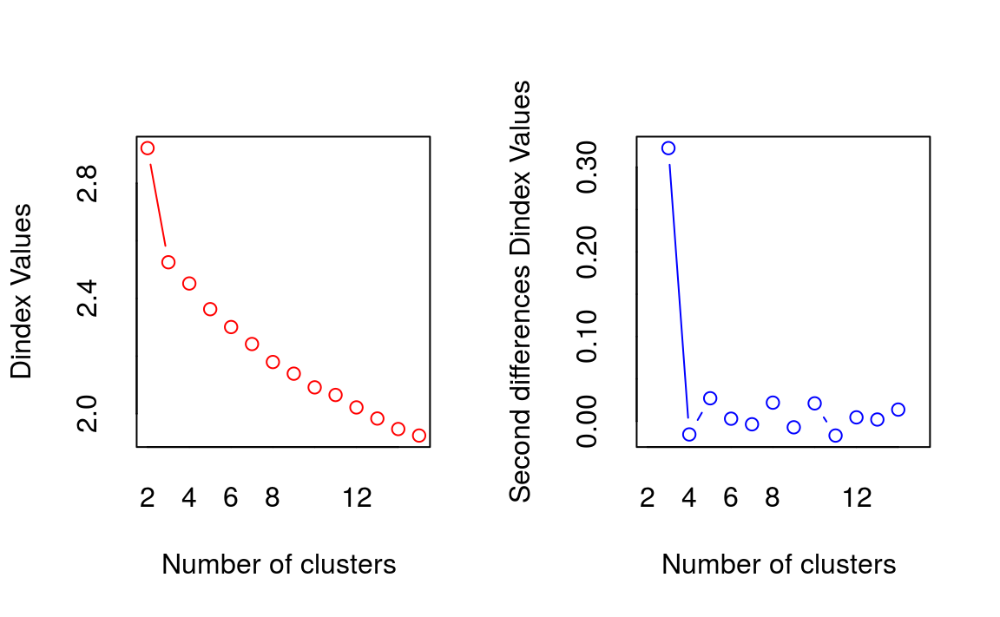

# 군집화 분석

군집화 분석의 목적은 관찰된 값을 일정 숫자의 집단으로 나누는 것입니다. 이 집단 사이에는 서로 최대한 다른 관찰값을 가지되, 한 집단에 소속된 관찰값은 최대한 비슷하도록 나누어야 합니다.

군집화 분석은 크게 두가지 방법이 쓰입니다.

- K-평균 군집화 기법(K-means): 원하는 군집의 개수인 k를 지정하면, 알고리즘은 각 관찰값이 k개의 군집 중 하나의 군집에만 속할 때까지 반복을 계속합니다.


해당 알고리즘의 작동 순서는 다음과 같습니다.

1. 만들고자 하는 군집의 개수(k)를 지정합니다.
2. 시작 평균으로 사용될 k개의 점들을 임의로 초기화합니다.
3. 다음의 내용을 반복합니다.
a.  각 관찰값을 가장 가까운 군집에 할당하는 방식으로 k개의 군집을 만듭니다. (군집 내 분산을 최소화)
b. 각 군집의 중점이 새로운 평균이 됩니다.
c. 각 군집의 중점이 더 이상 변하지 않을 때까지 이 과정을 반복합니다.

- 계층적 군집화 기법(hierarchical): 관찰값 사이의 비유사성 측정값을 기반으로 군집화를 합니다. 일반적으로 비유사성에는 유클리드 거리가 사용됩니다.

$$ dist(x,y) = \sqrt{\sum_{i=1}^n(x_i - yi)^2} $$


## K-Means (iris 데이터)

먼저 R의 기본 데이터인 iris 데이터를 통해 K-means 분석을 해보도록 합니다.

### 데이터 불러오기 및 편집


```r
set.seed(1234)

data(iris)
table(iris$Species)
```

```
## 
##     setosa versicolor  virginica 
##         50         50         50
```

iris 데이터는 총 3가지 종류의 클래스로 구분되어 있습니다.


```r
iris_km = iris[, 1:4]
iris_km = data.frame(scale(iris_km))
```

비지도 학습을 위해 label 피쳐를 제거한 피처를 선택합니다. 그 후 `scale()` 함수를 이용해 표준화를 해주도록 합니다.


```r
library(ggplot2)
library(magrittr)

iris_km %>%
  ggplot(aes(x = Petal.Length, y = Petal.Width)) +
  geom_point()
```


군집화 이전 Petal.Length와 Petal.Width를 점도표로 나타내 봅니다.


```r
iris_kmeans = kmeans(iris_km, centers = 3, iter.max = 10000)
print(iris_kmeans)
```

```
## K-means clustering with 3 clusters of sizes 50, 53, 47
## 
## Cluster means:
##   Sepal.Length Sepal.Width Petal.Length Petal.Width
## 1     -1.01119     0.85041      -1.3006     -1.2507
## 2     -0.05005    -0.88043       0.3466      0.2806
## 3      1.13218     0.08813       0.9928      1.0141
## 
## Clustering vector:
##   [1] 1 1 1 1 1 1 1 1 1 1 1 1 1 1 1 1 1 1 1 1 1 1 1 1 1 1 1 1 1 1 1 1 1 1 1 1 1
##  [38] 1 1 1 1 1 1 1 1 1 1 1 1 1 3 3 3 2 2 2 3 2 2 2 2 2 2 2 2 3 2 2 2 2 3 2 2 2
##  [75] 2 3 3 3 2 2 2 2 2 2 2 3 3 2 2 2 2 2 2 2 2 2 2 2 2 2 3 2 3 3 3 3 2 3 3 3 3
## [112] 3 3 2 2 3 3 3 3 2 3 2 3 2 3 3 2 3 3 3 3 3 3 2 2 3 3 3 2 3 3 3 2 3 3 3 2 3
## [149] 3 2
## 
## Within cluster sum of squares by cluster:
## [1] 47.35 44.09 47.45
##  (between_SS / total_SS =  76.7 %)
## 
## Available components:
## 
## [1] "cluster"      "centers"      "totss"        "withinss"     "tot.withinss"
## [6] "betweenss"    "size"         "iter"         "ifault"
```

`kmeans()` 함수를 통해 군집화를 수행할 수 있으며, centers 인자를 통해 몇개의 군집으로 나눌지 선택할 수 있습니다. 1~3개 군집에 각각 50, 53개, 47개 데이터가 선택되었습니다. 이를 그림으로 나타내보도록 합니다.


```r
iris_km$cluster = as.factor(iris_kmeans$cluster)

iris_km %>%
  ggplot(aes(x = Petal.Length, y = Petal.Width)) +
  geom_point(aes(color = cluster))
```


실제 데이터와 비교해보도록 하겠습니다. 1번 군집은 setosa, 2번 군집은 versicolor, 3번 군집은 virginica와 매칭됩니다.


```r
iris_km$culster = ifelse(iris_km$cluster == 1, 'setosa', 
                         ifelse(iris_km$cluster == 2, 'versicolor',
                                'virginica'))
caret::confusionMatrix(as.factor(iris_km$culster), as.factor(iris$Species))  
```

```
## Confusion Matrix and Statistics
## 
##             Reference
## Prediction   setosa versicolor virginica
##   setosa         50          0         0
##   versicolor      0         39        14
##   virginica       0         11        36
## 
## Overall Statistics
##                                         
##                Accuracy : 0.833         
##                  95% CI : (0.764, 0.889)
##     No Information Rate : 0.333         
##     P-Value [Acc > NIR] : <2e-16        
##                                         
##                   Kappa : 0.75          
##                                         
##  Mcnemar's Test P-Value : NA            
## 
## Statistics by Class:
## 
##                      Class: setosa Class: versicolor Class: virginica
## Sensitivity                  1.000             0.780            0.720
## Specificity                  1.000             0.860            0.890
## Pos Pred Value               1.000             0.736            0.766
## Neg Pred Value               1.000             0.887            0.864
## Prevalence                   0.333             0.333            0.333
## Detection Rate               0.333             0.260            0.240
## Detection Prevalence         0.333             0.353            0.313
## Balanced Accuracy            1.000             0.820            0.805
```

setosa는 완벽하게 구분했지만 versicolor와 virginica를 구분하는데는 오류가 있어, 약 83% 정도의 정확도를 보입니다.

## 와인 데이터 분석

178개 와인의 화학 조성을 나타내는 13개 변수를 통해 군집화를 하도록 하겠습니다.

### 데이터 불러오기 및 편집


```r
library(HDclassif)  

data(wine)
str(wine)
```

```
## 'data.frame':	178 obs. of  14 variables:
##  $ class: int  1 1 1 1 1 1 1 1 1 1 ...
##  $ V1   : num  14.2 13.2 13.2 14.4 13.2 ...
##  $ V2   : num  1.71 1.78 2.36 1.95 2.59 1.76 1.87 2.15 1.64 1.35 ...
##  $ V3   : num  2.43 2.14 2.67 2.5 2.87 2.45 2.45 2.61 2.17 2.27 ...
##  $ V4   : num  15.6 11.2 18.6 16.8 21 15.2 14.6 17.6 14 16 ...
##  $ V5   : int  127 100 101 113 118 112 96 121 97 98 ...
##  $ V6   : num  2.8 2.65 2.8 3.85 2.8 3.27 2.5 2.6 2.8 2.98 ...
##  $ V7   : num  3.06 2.76 3.24 3.49 2.69 3.39 2.52 2.51 2.98 3.15 ...
##  $ V8   : num  0.28 0.26 0.3 0.24 0.39 0.34 0.3 0.31 0.29 0.22 ...
##  $ V9   : num  2.29 1.28 2.81 2.18 1.82 1.97 1.98 1.25 1.98 1.85 ...
##  $ V10  : num  5.64 4.38 5.68 7.8 4.32 6.75 5.25 5.05 5.2 7.22 ...
##  $ V11  : num  1.04 1.05 1.03 0.86 1.04 1.05 1.02 1.06 1.08 1.01 ...
##  $ V12  : num  3.92 3.4 3.17 3.45 2.93 2.85 3.58 3.58 2.85 3.55 ...
##  $ V13  : int  1065 1050 1185 1480 735 1450 1290 1295 1045 1045 ...
```

각 피처는 다음과 같습니다.

- V1: 알콜
- V2: 말산
- V3: 재
- V4: 재의 알칼리성
- V5: 마그네슘
- V6: 페놀 총량
- V7: 플라보노이드
- V8: 비플라보노이드성 페놀
- V9: 프로안토시아닌
- V10: 색의 강도
- V11: 빛깔
- V12: OD280/OD315
- V13: 프롤린

변수의 이름을 정해준 후, 표준화를 실시합니다. 또한 비지도 학습을 위해 label인 Class는 제거해주도록 합니다.


```r
names(wine) = c('Class', 'Alcohol', 'MalicAcid', 'Ash', 'Alk_ash', 'magnesium', 'T_phenols', 'flavonoids', 'Non_flav', 'Proantho', 'C_Intensity', 'Hue', '00280_315', 'Proline')

df = as.data.frame(scale(wine[, -1]))
```

품종(class)의 분포를 살펴보도록 하겠습니다.


```r
table(wine$Class)
```

```
## 
##  1  2  3 
## 59 71 48
```

각 품종에 골고루 분포되어 있는 모습입니다.

### K-평균 군집화

`NbClust()` 함수를 이용해 최적의 군집 수를 찾을 수 있습니다.


```r
library(NbClust)

numKmeans = NbClust(df, min.nc = 2, max.nc = 15, method = 'kmeans')
```

```
## *** : The Hubert index is a graphical method of determining the number of clusters.
##                 In the plot of Hubert index, we seek a significant knee that corresponds to a 
##                 significant increase of the value of the measure i.e the significant peak in Hubert
##                 index second differences plot. 
## 
```

```
## *** : The D index is a graphical method of determining the number of clusters. 
##                 In the plot of D index, we seek a significant knee (the significant peak in Dindex
##                 second differences plot) that corresponds to a significant increase of the value of
##                 the measure. 
##  
## ******************************************************************* 
## * Among all indices:                                                
## * 2 proposed 2 as the best number of clusters 
## * 19 proposed 3 as the best number of clusters 
## * 1 proposed 14 as the best number of clusters 
## * 1 proposed 15 as the best number of clusters 
## 
##                    ***** Conclusion *****                            
##  
## * According to the majority rule, the best number of clusters is  3 
##  
##  
## *******************************************************************
```



결과를 보면 3개의 군집이 최적 숫자인 것으로 판명됩니다. 해당 k를 바탕으로 `kmeans()` 함수를 이용해 K-평균 군집화 분석을 수행합니다. nstart 인자는 초기 임의 군집을 몇개 생성할지를 정하는 값입니다.


```r
set.seed(1234)
km = kmeans(df, 3, nstart = 25)

table(km$cluster)
```

```
## 
##  1  2  3 
## 62 65 51
```

원 데이터의 class와 비교를 통해  정확도를 평가해보도록 합니다.


```r
caret::confusionMatrix(as.factor(km$cluster), as.factor(wine$Class))
```

```
## Confusion Matrix and Statistics
## 
##           Reference
## Prediction  1  2  3
##          1 59  3  0
##          2  0 65  0
##          3  0  3 48
## 
## Overall Statistics
##                                         
##                Accuracy : 0.966         
##                  95% CI : (0.928, 0.988)
##     No Information Rate : 0.399         
##     P-Value [Acc > NIR] : <2e-16        
##                                         
##                   Kappa : 0.949         
##                                         
##  Mcnemar's Test P-Value : NA            
## 
## Statistics by Class:
## 
##                      Class: 1 Class: 2 Class: 3
## Sensitivity             1.000    0.915    1.000
## Specificity             0.975    1.000    0.977
## Pos Pred Value          0.952    1.000    0.941
## Neg Pred Value          1.000    0.947    1.000
## Prevalence              0.331    0.399    0.270
## Detection Rate          0.331    0.365    0.270
## Detection Prevalence    0.348    0.365    0.287
## Balanced Accuracy       0.987    0.958    0.988
```

0.9663의 높은 정확도를 보입니다.

### 계층적 군집화

위와 동일하게 `NbClust()` 함수 내 인자를 바꾸어, 계층적 군집화 기준 최적의 군집 수를 찾도록 합니다.


```r
numComplete = NbClust(df, distance  = 'euclidean', min.nc = 2, max.nc = 6, method = 'complete', index = 'all')
```

```
## *** : The Hubert index is a graphical method of determining the number of clusters.
##                 In the plot of Hubert index, we seek a significant knee that corresponds to a 
##                 significant increase of the value of the measure i.e the significant peak in Hubert
##                 index second differences plot. 
## 
```

```
## *** : The D index is a graphical method of determining the number of clusters. 
##                 In the plot of D index, we seek a significant knee (the significant peak in Dindex
##                 second differences plot) that corresponds to a significant increase of the value of
##                 the measure. 
##  
## ******************************************************************* 
## * Among all indices:                                                
## * 1 proposed 2 as the best number of clusters 
## * 11 proposed 3 as the best number of clusters 
## * 6 proposed 5 as the best number of clusters 
## * 5 proposed 6 as the best number of clusters 
## 
##                    ***** Conclusion *****                            
##  
## * According to the majority rule, the best number of clusters is  3 
##  
##  
## *******************************************************************
```


역시나 3개의 군집이 최적으로 나타납니다. 이제 3개의 군집을 사용해 거리 행렬을 계산하도록 합니다.


```r
dis = dist(df, method = 'euclidean')
```

해당 행렬을 `hclust()` 함수의 입력값으로 사용해 군집화를 합니다.


```r
hc = hclust(dis, method = 'complete')
plot(hc, hang = -1, labels = FALSE)
```


`cutree()` 함수를 이용해 군집을 나눈후, sparcl 패키지의 `cutree()` 함수를 이용하면 군집을 시각화할 수 있습니다.


```r
library(sparcl)

comp3 = cutree(hc, 3)
ColorDendrogram(hc, y = comp3, branchlength = 50)
```


각 군집 별로 색이 다르게 나타납니다. 마지막으로 원 데이터의 class와 비교를 통해 정확도를 계산해보도록 합니다.


```r
caret::confusionMatrix(as.factor(comp3), as.factor(wine$Class))
```

```
## Confusion Matrix and Statistics
## 
##           Reference
## Prediction  1  2  3
##          1 51 18  0
##          2  8 50  0
##          3  0  3 48
## 
## Overall Statistics
##                                         
##                Accuracy : 0.837         
##                  95% CI : (0.774, 0.888)
##     No Information Rate : 0.399         
##     P-Value [Acc > NIR] : <2e-16        
##                                         
##                   Kappa : 0.755         
##                                         
##  Mcnemar's Test P-Value : NA            
## 
## Statistics by Class:
## 
##                      Class: 1 Class: 2 Class: 3
## Sensitivity             0.864    0.704    1.000
## Specificity             0.849    0.925    0.977
## Pos Pred Value          0.739    0.862    0.941
## Neg Pred Value          0.927    0.825    1.000
## Prevalence              0.331    0.399    0.270
## Detection Rate          0.287    0.281    0.270
## Detection Prevalence    0.388    0.326    0.287
## Balanced Accuracy       0.857    0.815    0.988
```

0.8371의 정확도를 보입니다.
